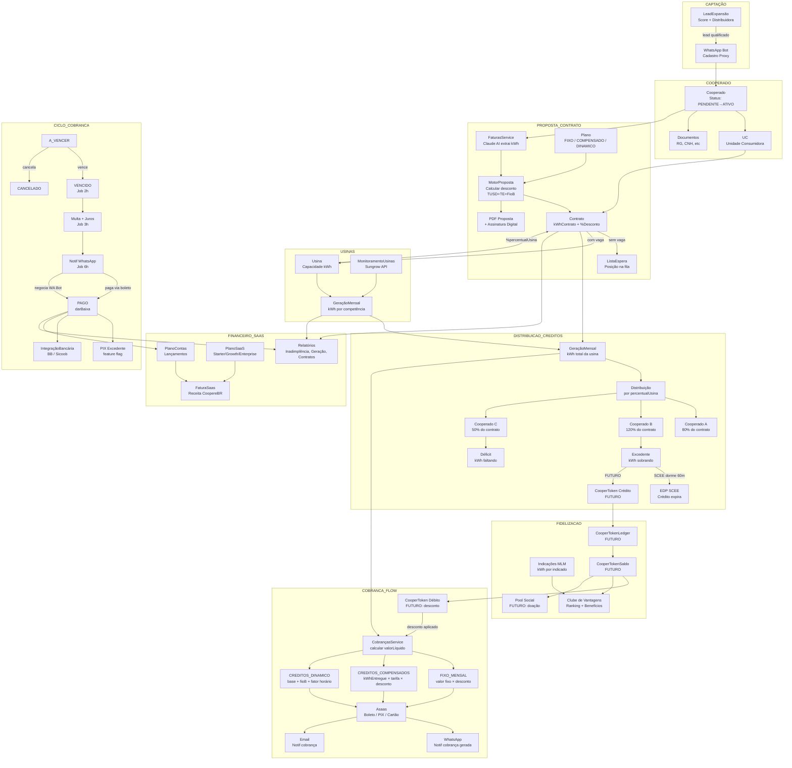

# 🗺️ Diagrama & Workflow Completo — CoopereBR
**Versão:** 1.0 | **Data:** 2026-03-31 | **Autor:** Assis 🤝

---

## DIAGRAMA MERMAID — FLUXO COMPLETO DO SISTEMA



---

## WORKFLOW SEQUENCIAL — DO COOPERADO À BAIXA

```
┌─────────────────────────────────────────────────────────────────────────┐
│ ETAPA 1 — CAPTAÇÃO                                                       │
│                                                                          │
│  Lead chega ──► LeadExpansão calcula score (0-7)                        │
│                    │                                                     │
│                    ├── score alto → operador aciona                      │
│                    └── WhatsApp Bot → cadastro por proxy                 │
└─────────────────────────────────────────────────────────────────────────┘
                              │
                              ▼
┌─────────────────────────────────────────────────────────────────────────┐
│ ETAPA 2 — CADASTRO (transação Serializable)                              │
│                                                                          │
│  ┌─────────────────────────────────────┐                                 │
│  │ prisma.$transaction                  │                                 │
│  │  1. criar Cooperado (PENDENTE)       │                                 │
│  │  2. criar UC (endereço + medidor)    │                                 │
│  │  3. validar distribuidora ANEEL      │                                 │
│  │  4. validar capacidade usina         │                                 │
│  │  5. criar Contrato                   │                                 │
│  │  6. posicionar ListaEspera           │                                 │
│  └─────────────────────────────────────┘                                 │
│                                                                          │
│  + Upload documentos (pós-transação, assíncrono)                        │
└─────────────────────────────────────────────────────────────────────────┘
                              │
                              ▼
┌─────────────────────────────────────────────────────────────────────────┐
│ ETAPA 3 — PROPOSTA                                                       │
│                                                                          │
│  FaturasService ──► Claude AI extrai da foto da fatura:                 │
│    • TUSD, TE, kWh consumido, histórico 12m                              │
│    • distribuidora, UC, tipo fornecimento                                │
│                                                                          │
│  MotorProposta.calcular():                                               │
│    tarifaUnitSemTrib = TUSD + TE                                         │
│    kwhApuradoBase = valorFatura / kwhConsumo                             │
│    descontoAbsoluto = tarifaUnit × (desconto% / 100)                    │
│    valorCooperado = kwhApuradoBase - descontoAbsoluto                   │
│    economiaMensal = descontoAbsoluto × kwhContrato                      │
│    [+ Fio B futuro: × percentualFioB]                                   │
│                                                                          │
│  Outlier detection:                                                      │
│    kwhMesRecente > média12m × threshold                                  │
│    → oferecer opção ou usar maior retorno                                │
│                                                                          │
│  Resultado → PDF → Assinatura Digital (token JWT, expira 7d)            │
└─────────────────────────────────────────────────────────────────────────┘
                              │
                              ▼
┌─────────────────────────────────────────────────────────────────────────┐
│ ETAPA 4 — ALOCAÇÃO NA USINA                                              │
│                                                                          │
│  MotorProposta.aceitar():                                                │
│    1. Buscar usina com mesma distribuidora da UC (regra ANEEL)          │
│    2. Calcular kWhDisponivel = capacidade - soma(kwhContrato ativos)    │
│    3. Se kWhDisponivel >= kwhContrato:                                  │
│          Contrato → PENDENTE_ATIVACAO                                   │
│          percentualUsina = kwhContrato / capacidadeUsina × 100          │
│    4. Se sem vaga:                                                       │
│          Contrato → LISTA_ESPERA                                        │
│          ListaEspera.posicao = count(AGUARDANDO) + 1                    │
│                                                                          │
│  checkProntoParaAtivar():                                                │
│    documentos ✅ + assinatura ✅ → Cooperado ATIVO                      │
└─────────────────────────────────────────────────────────────────────────┘
                              │
                              ▼
┌─────────────────────────────────────────────────────────────────────────┐
│ ETAPA 5 — DISTRIBUIÇÃO DE CRÉDITOS (MENSAL)                              │
│                                                                          │
│  Usina gera X kWh no mês (GeraçãoMensal, fonte: Sungrow ou manual)     │
│                                                                          │
│  Para cada contrato ATIVO na usina:                                      │
│    kWhEntregue = kWhTotalUsina × percentualUsina / 100                  │
│                                                                          │
│  Classificação por cooperado:                                            │
│    kWhEntregue >= kWhContrato × 80%  → ADEQUADO                         │
│    kWhEntregue >= kWhContrato × 100% → SUPERAVITÁRIO (excedente vai     │
│                                         para SCEE da distribuidora)     │
│    kWhEntregue < kWhContrato × 80%   → DEFICITÁRIO (cooperado paga      │
│                                         diferença à distribuidora)      │
│                                                                          │
│  [FUTURO — CooperToken]                                                  │
│    Excedente > 0 → creditar tokens (CooperTokenJob)                     │
│    Tokens → desconto na próxima cobrança                                │
└─────────────────────────────────────────────────────────────────────────┘
                              │
                              ▼
┌─────────────────────────────────────────────────────────────────────────┐
│ ETAPA 6 — GERAÇÃO DE COBRANÇA                                            │
│                                                                          │
│  CobrancasService.create():                                              │
│                                                                          │
│  FIXO_MENSAL:                                                            │
│    valorBruto = kwhContrato × tarifaUnit                                │
│    valorDesconto = valorBruto × (desconto / 100)                        │
│    valorLiquido = valorBruto - valorDesconto                            │
│    [FUTURO: - tokenDesconto]                                             │
│                                                                          │
│  CREDITOS_COMPENSADOS:                                                   │
│    valorBruto = kwhEntregue × tarifaUnit                                │
│    valorDesconto = kwhEntregue × descontoAbsoluto                       │
│    valorLiquido = valorBruto - valorDesconto                            │
│    kwhSaldo = kwhEntregue - kwhContrato (pode ser negativo)             │
│                                                                          │
│  CREDITOS_DINAMICO:                                                      │
│    [base + fioB% + fatorHorário + tokenDesconto]                        │
│                                                                          │
│  → Emitir boleto no Asaas                                               │
│  → Notificar cooperado (WhatsApp + Email)                               │
└─────────────────────────────────────────────────────────────────────────┘
                              │
                              ▼
┌─────────────────────────────────────────────────────────────────────────┐
│ ETAPA 7 — CICLO DE VIDA DA COBRANÇA                                      │
│                                                                          │
│  Criada → status: A_VENCER                                              │
│                                                                          │
│  Job 2h (diário): marcarVencidas()                                       │
│    dataVencimento < hoje → status: VENCIDO                              │
│                                                                          │
│  Job 3h (diário): calcularMultaJuros()                                  │
│    diasAtraso > diasCarência (por cooperativa)                          │
│    multa = valorLiquido × multaAtraso% (arredondado ✅)                 │
│    juros = valorLiquido × jurosDiarios% × diasEfetivos (arredondado ✅)│
│    valorAtualizado = valorLiquido + multa + juros                       │
│                                                                          │
│  Job 6h (diário): notificarCobrancasVencidas()                          │
│    → WhatsApp (rate limit: intervaloMinCobrancaHoras por cooperativa)   │
│    → flag notificadoVencimento evita spam                               │
│                                                                          │
│  Negociação via WhatsApp Bot:                                           │
│    → parcelamento → observacoesNegociacao ✅                            │
│    → pagamento → darBaixa()                                             │
│                                                                          │
│  darBaixa():                                                             │
│    status → PAGO                                                        │
│    dataPagamento, valorPago, metodoPagamento                            │
│    → Lançamento no PlanoContas                                          │
│    → PIX Excedente (flag ASAAS_PIX_EXCEDENTE_ATIVO) ✅                 │
│    → IntegraçãoBancária (retorno BB/Sicoob)                             │
└─────────────────────────────────────────────────────────────────────────┘
                              │
                              ▼
┌─────────────────────────────────────────────────────────────────────────┐
│ ETAPA 8 — FIDELIZAÇÃO & RELATÓRIOS                                       │
│                                                                          │
│  Clube de Vantagens:                                                     │
│    kWhIndicado por mês/ano (reset automático)                           │
│    Ranking mensal/anual por cooperado                                   │
│    Níveis validados sem sobreposição ✅                                 │
│                                                                          │
│  Indicações MLM:                                                        │
│    indicação → kWhIndicadoMes++ do indicador                           │
│    WhatsApp Bot MLM → fluxo de cadastro via proxy                       │
│                                                                          │
│  Relatórios (lê direto do banco — ver gap abaixo):                      │
│    Inadimplência estratificada (por usina/cooperativa/tipo)             │
│    Geração mensal por usina                                             │
│    Contratos ativos/lista espera                                        │
│    FaturaSaas (receita CoopereBR)                                       │
└─────────────────────────────────────────────────────────────────────────┘
```

---

## GAP PRINCIPAL — RELATÓRIOS & SOLUÇÃO TÉCNICA

### O problema atual

`RelatoriosService` acessa o banco diretamente via Prisma, sem passar por nenhum domínio de negócio:

```typescript
// ATUAL — problemático
class RelatoriosService {
  constructor(private prisma: PrismaService) {} // só Prisma, sem serviços

  async inadimplencia(filtros) {
    return this.prisma.cobranca.findMany({ where: ..., include: ... })
    // lógica de filtro feita em memória depois (ineficiente)
  }
}
```

**Consequências:**
1. Filtros complexos (ex: por tipoCooperado aninhado) feitos em memória — não escala
2. Regras de negócio duplicadas (cálculo de tarifa, desconto, Fio B aparecem de novo)
3. Tenant isolation manual em cada query (cooperativaId esquecido = vazamento de dados)
4. Impossível adicionar dados do CooperToken sem mexer nas queries cruas

---

### Solução técnica robusta

**Arquitetura: Query Layer com Bounded Context**

```typescript
// backend/src/relatorios/relatorios-query.service.ts
// Serviço intermediário que AGREGA dados dos serviços de domínio

@Injectable()
export class RelatoriosQueryService {
  constructor(
    private prisma: PrismaService,
    private cobrancasService: CobrancasService,      // domínio de cobrança
    private geracaoMensalService: GeracaoMensalService, // domínio de geração
    private contratosService: ContratosService,       // domínio de contrato
    // FUTURO:
    // private cooperTokenService: CooperTokenService,
  ) {}

  // Relatório de inadimplência usa CobrancasService (com tenant isolation nativo)
  async inadimplencia(filtros: InadimplenciaFiltros, cooperativaId: string) {
    const cobrancas = await this.cobrancasService.findAll(cooperativaId, ['VENCIDO'])
    // filtros adicionais com tipagem forte, não em memória livre
    return this.aplicarFiltros(cobrancas, filtros)
  }

  // Relatório de geração usa GeracaoMensalService
  async geracaoPorUsina(usinaId: string, ano: number) {
    return this.geracaoMensalService.findAll(usinaId, ano)
  }

  // Relatório cross-módulo: produção vs cobrança por cooperado
  async producaoVsCobranca(cooperativaId: string, competencia: string) {
    const [geracao, cobrancas, contratos] = await Promise.all([
      this.prisma.geracaoMensal.findMany({ where: { usina: { cooperativaId }, competencia: new Date(competencia) } }),
      this.cobrancasService.findAll(cooperativaId),
      this.contratosService.findByCooperativa(cooperativaId),
    ])
    return this.consolidarProducaoCobranca(geracao, cobrancas, contratos)
  }
}
```

**Views materializadas no banco (PostgreSQL)**

Para relatórios pesados, criar views para evitar full scan:

```sql
-- View: posição real de cada cooperado (superavitário / deficitário)
CREATE MATERIALIZED VIEW vw_posicao_cooperado AS
SELECT
  co.id AS cooperado_id,
  co.nome_completo,
  co.cooperativa_id,
  c.id AS contrato_id,
  c.kwh_contrato,
  c.percentual_usina,
  gm.kwh_gerado * (c.percentual_usina / 100) AS kwh_entregue,
  (gm.kwh_gerado * (c.percentual_usina / 100)) - c.kwh_contrato AS excedente_kwh,
  gm.competencia
FROM contratos c
JOIN cooperados co ON c.cooperado_id = co.id
JOIN geracao_mensal gm ON gm.usina_id = c.usina_id
WHERE c.status = 'ATIVO'
WITH DATA;

-- Refresh: chamar após cada GeraçãoMensal inserida
REFRESH MATERIALIZED VIEW CONCURRENTLY vw_posicao_cooperado;
```

**Interface de relatórios tipada**

```typescript
// Tipos fortes em vez de any
interface InadimplenciaFiltros {
  usinaId?: string
  cooperativaId: string          // obrigatório — previne vazamento
  tipoCooperado?: TipoCooperado  // enum, não string livre
  periodoInicio?: Date
  periodoFim?: Date
  faixaValor?: { min: number; max: number }
}

interface ProducaoVsCobrancaRow {
  cooperadoId: string
  nome: string
  kwhContrato: number
  kwhEntregue: number
  excedente: number              // positivo = superavitário
  valorCobranca: number
  tokensSaldo?: number           // FUTURO: saldo CooperToken
  status: 'SUPERAVITARIO' | 'DEFICITARIO' | 'ADEQUADO'
}
```

---

## CONEXÃO USINAS → GERAÇÃO → CRÉDITOS → COBRANÇA (DETALHE)

```
Usina
  capacidadeKwh: 500 kWh/mês
  distribuidora: EDP-ES
  contratos ativos: 4
  │
  ├── Contrato A: 150 kWh (30%) — Cooperado A
  ├── Contrato B: 120 kWh (24%) — Cooperado B
  ├── Contrato C: 130 kWh (26%) — Cooperado C
  └── Contrato D: 100 kWh (20%) — Cooperado D
                              Total alocado: 500 kWh (100%)

GeraçãoMensal (março/2026): 420 kWh gerados (usina rendeu 84%)
  │
  ├── Cooperado A: 420 × 30% = 126 kWh entregue (contrato: 150) → déficit 24 kWh
  ├── Cooperado B: 420 × 24% = 100,8 kWh entregue (contrato: 120) → déficit 19,2 kWh
  ├── Cooperado C: 420 × 26% = 109,2 kWh entregue (contrato: 130) → déficit 20,8 kWh
  └── Cooperado D: 420 × 20% = 84 kWh entregue (contrato: 100) → déficit 16 kWh

Modelo CREDITOS_COMPENSADOS:
  Cooperado A cobrança:
    valorBruto = 126 × R$0,78931 = R$99,45
    desconto = 20% = R$19,89
    valorLíquido = R$79,56
    kwhSaldo = -24 (déficit — cooperado paga diferença na conta EDP)

Modelo FIXO_MENSAL:
  Cooperado A cobrança:
    valorBruto = 150 × R$0,78931 = R$118,40
    desconto = 20% = R$23,68
    valorLíquido = R$94,72
    (independe de quantos kWh foram entregues)

[FUTURO — com CooperToken e mês anterior com excedente]
  Se Cooperado A tinha 30 tokens:
    tokenDesconto = 30 × R$0,45 = R$13,50
    valorFinal = R$94,72 - R$13,50 = R$81,22
```

---

## PLANO DE AÇÃO — FECHAR OS GAPS

| # | Gap | Solução | Esforço |
|---|---|---|---|
| 1 | Relatórios lê banco direto | `RelatoriosQueryService` + views materializadas | 1 semana |
| 2 | View `vw_posicao_cooperado` não existe | Migration SQL com MATERIALIZED VIEW | 2h |
| 3 | CooperToken não implementado | SPEC-COOPERTOKEN-v1.md → Fase 1 | 2 semanas |
| 4 | Fio B não está no motor | Aguarda dados das 3 usinas (João Luiz) | 3h após dados |
| 5 | WA-BOT-05 NPS setTimeout | Persistir flag `npsPendente` + cron | 3h |
| 6 | Prisma migrations baseline | Executar baseline + migrate deploy | 1h |
| 7 | LEAD-04 score sem decaimento | Função exponencial por dias de inatividade | 2h |

---

*Documento gerado por Assis — assistente IA da CoopereBR*
*2026-03-31*
