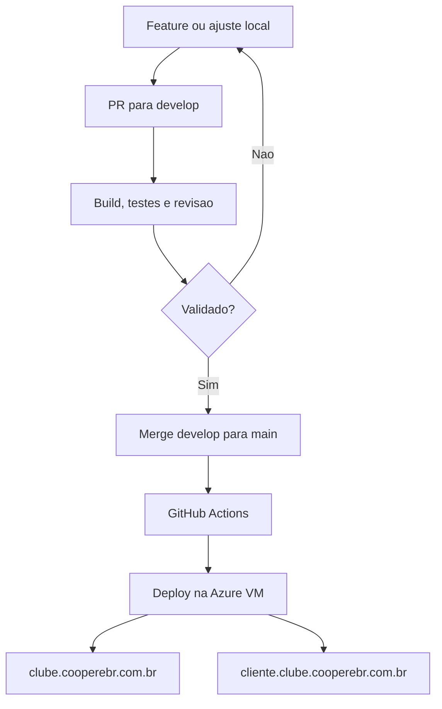

# COOPERE-BR

Plataforma SaaS para gestao de cooperativas de energia solar, Clube de Vantagens,
CooperTokens, convenios empresariais e portal do cooperado.

## Estrutura Principal

- `backend/`: API NestJS, regras de negocio, Prisma, CooperToken, Clube de Vantagens, convenios e financeiro.
- `web/`: aplicacao Next.js com landing page, login, portal do cooperado, dashboards e telas publicas.
- `whatsapp-service/`: servico de integracao WhatsApp.
- `deploy/azure-vm/`: scripts de bootstrap e deploy da VM Azure do Clube COOPERE-BR.
- `.github/workflows/`: automacoes do GitHub Actions.
- `docs/`: playbooks, memoria do projeto, sessoes e documentacao tecnica.

## Branches e Publicacao

Neste repositorio a branch principal real e `main`. Ela equivale ao que algumas
equipes chamam de `master`.

- `develop`: branch de preparacao e testes antes de producao.
- `main`: branch principal usada para refletir em producao.
- `master`: nao existe hoje; se for criada no futuro, o workflow de deploy ja esta preparado para aceita-la.

Regra pratica:

- Para testar e organizar mudancas, use `develop`.
- Para publicar em producao, faca merge de `develop` para `main`.
- Push em `main` dispara o deploy do Clube COOPERE-BR no Azure.

## Deploy do Clube COOPERE-BR

O workflow de producao fica em:

`.github/workflows/deploy-clube-cooperebr-vm.yml`

Ele publica na VM Azure usando:

`deploy/azure-vm/deploy.sh`

URLs principais:

- `https://clube.cooperebr.com.br`
- `https://cliente.clube.cooperebr.com.br/login`
- `https://cliente.clube.cooperebr.com.br/entrar`

## Fluxo Recomendado

## Memoria Operacional

Leia tambem:

`docs/playbooks/memoria-fluxo-branches-deploy.md`
