# RAIO-X DO PROJETO — CoopereBR

> Gerado em 2026-04-20 | Commit de referencia: `9e409bc`
> Plataforma SaaS multi-tenant para cooperativas, consorcios e associacoes de energia solar em Geracao Distribuida (GD), regulamentada pela ANEEL.

---

## 1. Identidade do Projeto

| Campo | Valor |
|---|---|
| Nome | CoopereBR |
| Dono | Luciano (nao-desenvolvedor; juiz TJES, fundador) |
| Tipo | SaaS multi-tenant B2B2C |
| Dominio | Gestao de cooperativas de energia solar — GD (ANEEL) |
| Backend | NestJS + Prisma ORM + PostgreSQL (Supabase) |
| Frontend | Next.js 16 (App Router) + Shadcn/UI + Tailwind CSS |
| WhatsApp | whatsapp-service (Baileys) |
| OCR | Claude AI (Anthropic) |
| Pagamentos | Asaas (PIX + boleto) + integracao bancaria BB/Sicoob |
| Auth | JWT — roles: SUPER_ADMIN, ADMIN, OPERADOR, COOPERADO, AGREGADOR |
| Modulos backend | 44 |
| Paginas frontend | 80+ |
| Models Prisma | 80+ (`backend/prisma/schema.prisma`:2029 linhas) |
| Ultimo commit | `9e409bc` |

---

## 2. Contagem de Registros por Model

Snapshot do banco de dados em 2026-04-20.

### Nucleo

| Model | Registros | Arquivo | Observacao |
|---|---|---|---|
| Cooperativa | 5 | `schema.prisma:11` | 1 junk ("aaaaaaa", CONDOMINIO TRIAL) |
| Usuario | 11 | `schema.prisma:82` | |
| Cooperado | 125 | `schema.prisma:105` | 5 orfaos com cooperativaId=null |
| DocumentoCooperado | 4 | `schema.prisma:192` | |
| Uc | 108 | `schema.prisma:271` | |
| Usina | 10 | `schema.prisma:298` | 6 CoopereBR + 1 Consorcio + 1 CoopereVerde + 2 Teste |
| Contrato | 73 | `schema.prisma:345` | |
| Plano | 9 | `schema.prisma:394` | |
| Cobranca | 30 | `schema.prisma:472` | |
| Ocorrencia | 4 | `schema.prisma` | |

### Faturas e Geracao

| Model | Registros | Arquivo | Observacao |
|---|---|---|---|
| FaturaProcessada | 8 | `schema.prisma:593` | OCR via Claude AI |
| GeracaoMensal | 15 | `schema.prisma:844` | |
| TarifaConcessionaria | 2 | `schema.prisma` | |
| BandeiraTarifaria | 2 | `schema.prisma` | |
| HistoricoReajuste | 1 | `schema.prisma` | |
| HistoricoReajusteTarifa | 0 | `schema.prisma` | |

### Configuracao

| Model | Registros | Arquivo | Observacao |
|---|---|---|---|
| ConfigTenant | 14 | `schema.prisma` | |
| ConfiguracaoMotor | 1 | `schema.prisma` | |
| ConfiguracaoCobranca | 5 | `schema.prisma:827` | |
| ModeloCobrancaConfig | 4 | `schema.prisma` | |
| AsaasConfig | 1 | `schema.prisma:1211` | |

### Propostas e Contratos

| Model | Registros | Arquivo | Observacao |
|---|---|---|---|
| PropostaCooperado | 4 | `schema.prisma:743` | |
| ListaEspera | 32 | `schema.prisma:860` | |

### Financeiro

| Model | Registros | Arquivo | Observacao |
|---|---|---|---|
| PlanoContas | 24 | `schema.prisma` | |
| LancamentoCaixa | 35 | `schema.prisma` | |
| TransferenciaPix | 5 | `schema.prisma` | PIX excedente |
| PlanoSaas | 2 | `schema.prisma` | PRATA R$5900 + OUTRO R$9999 |
| FaturaSaas | 0 | `schema.prisma` | Nunca gerada — sem cron |
| ContaAPagar | 0 | `schema.prisma` | Modulo existe, nunca usado |

### Comunicacao

| Model | Registros | Arquivo | Observacao |
|---|---|---|---|
| Notificacao | 37 | `schema.prisma` | |
| ConversaWhatsapp | 43 | `schema.prisma` | |
| MensagemWhatsapp | 531 | `schema.prisma` | |
| ModeloMensagem | 21 | `schema.prisma` | |
| FluxoEtapa | 22 | `schema.prisma` | |
| EmailLog | 1 | `schema.prisma` | |

### Comercial

| Model | Registros | Arquivo | Observacao |
|---|---|---|---|
| Indicacao | 10 | `schema.prisma` | |
| ConviteIndicacao | 0 | `schema.prisma` | |
| BeneficioIndicacao | 0 | `schema.prisma` | |
| ConfigIndicacao | 1 | `schema.prisma` | |
| CooperTokenLedger | 6 | `schema.prisma` | |
| CooperTokenSaldo | 3 | `schema.prisma` | |
| ConfigCooperToken | 0 | `schema.prisma` | |
| CooperTokenSaldoParceiro | 0 | `schema.prisma` | |
| CooperTokenCompra | 0 | `schema.prisma` | |
| ConfigClubeVantagens | 1 | `schema.prisma` | |
| ProgressaoClube | 1 | `schema.prisma` | |
| HistoricoProgressao | 0 | `schema.prisma` | |
| OfertaClube | 0 | `schema.prisma` | |
| ResgateClubeVantagens | 0 | `schema.prisma` | |

### Condominio / Convenio

| Model | Registros | Arquivo | Observacao |
|---|---|---|---|
| Administradora | 1 | `schema.prisma` | |
| Condominio | 1 | `schema.prisma` | |
| UnidadeCondominio | 10 | `schema.prisma` | |
| ContratoConvenio | 0 | `schema.prisma:1023` | |
| ConvenioCooperado | 0 | `schema.prisma` | |
| HistoricoFaixaConvenio | 0 | `schema.prisma` | |

### Nao utilizados (0 registros)

| Model | Observacao |
|---|---|
| Prestador | Nunca usado |
| UsinaMonitoramentoConfig | Nunca configurado |
| UsinaLeitura | Nunca alimentado |
| UsinaAlerta | Nunca disparado |
| ContratoUso | Nunca criado |
| FormaPagamentoCooperado | Nunca preenchido |
| ConfiguracaoBancaria | Nunca configurado |
| CobrancaBancaria | Nunca emitido |
| AsaasCustomer | Nunca criado — Asaas nunca usado em producao |
| AsaasCobranca | Nunca criada |
| ModeloDocumento | Nunca criado |
| ConfiguracaoNotificacaoCobranca | Nunca configurado |
| ListaContatos | Nunca preenchido |
| ObservacaoAtiva | Nunca criada |
| LogObservacao | Nunca registrado |
| LeadExpansao | Nunca criado |
| NpsResposta | Nunca coletada |
| ConversaoCreditoSemUc | Nunca criada |
| HistoricoStatusCooperado | 0 registros — audit trail nao funciona |

---

## 3. Mapa de Sidebar (Navegacao)

Fonte: `web/app/dashboard/layout.tsx:54-178`

### Role: COOPERADO (`layout.tsx:55-63`)

| Item | Rota | Status |
|---|---|---|
| Dashboard | `/dashboard` | FUNCIONAL |
| Meu Convite | `/dashboard/meu-convite` | FUNCIONAL |
| Indicacoes | `/dashboard/indicacoes` | FUNCIONAL |

### Role: OPERADOR (`layout.tsx:65-80`)

| Item | Rota | Status |
|---|---|---|
| Dashboard | `/dashboard` | FUNCIONAL |
| Membros | `/dashboard/cooperados` | FUNCIONAL |
| UCs | `/dashboard/ucs` | FUNCIONAL |
| Contratos | `/dashboard/contratos` | FUNCIONAL |
| Cobrancas | `/dashboard/cobrancas` | FUNCIONAL |
| Ocorrencias | `/dashboard/ocorrencias` | FUNCIONAL — 4 registros |
| WhatsApp | `/dashboard/whatsapp` | FUNCIONAL |
| Indicacoes | `/dashboard/indicacoes` | FUNCIONAL |
| Meu Convite | `/dashboard/meu-convite` | FUNCIONAL |
| Convites | `/dashboard/convites` | FUNCIONAL |

### Role: ADMIN / SUPER_ADMIN — Administracao (`layout.tsx:89-96`)

| Item | Rota | Visibilidade | Status |
|---|---|---|---|
| Dashboard | `/dashboard` | ADMIN + SA | FUNCIONAL |
| Usuarios | `/dashboard/usuarios` | ADMIN + SA | FUNCIONAL — 11 registros |
| Parceiros SISGD | `/dashboard/cooperativas` | SUPER_ADMIN only | FUNCIONAL — 5 cooperativas |
| Observador | `/dashboard/observador` | ADMIN + SA | FUNCIONAL — 0 observacoes ativas |

### Role: ADMIN / SUPER_ADMIN — Operacional (`layout.tsx:97-121`)

| Item | Rota | Status |
|---|---|---|
| Membros | `/dashboard/cooperados` | FUNCIONAL — 125 cooperados |
| UCs | `/dashboard/ucs` | FUNCIONAL — 108 UCs |
| Usinas | `/dashboard/usinas` | FUNCIONAL — 10 usinas |
| Listas Concessionaria | `/dashboard/usinas/listas` | DESCONHECIDO |
| Contratos | `/dashboard/contratos` | FUNCIONAL — 73 contratos |
| Planos | `/dashboard/planos` | FUNCIONAL — 9 planos |
| Ocorrencias | `/dashboard/ocorrencias` | FUNCIONAL — 4 registros |
| Motor de Proposta | `/dashboard/motor-proposta` | FUNCIONAL — 4 propostas |
| Lista de Espera | `/dashboard/motor-proposta/lista-espera` | FUNCIONAL — 32 na fila |
| WhatsApp | `/dashboard/whatsapp` | FUNCIONAL — 43 conversas, 531 msgs |
| Config. WhatsApp | `/dashboard/whatsapp-config` | FUNCIONAL |
| Indicacoes | `/dashboard/indicacoes` | FUNCIONAL — 10 indicacoes |
| Meu Convite | `/dashboard/meu-convite` | FUNCIONAL |
| Convites | `/dashboard/convites` | FUNCIONAL — 0 enviados |
| CooperToken | `/dashboard/cooper-token` | ESQUELETO — 6 ledger, 3 saldos, 0 config |
| Clube de Vantagens | `/dashboard/clube-vantagens` | ESQUELETO — 1 config, 0 resgates, 0 ofertas |
| Ranking Indicadores | `/dashboard/clube-vantagens/ranking` | ESQUELETO |
| Convenios | `/dashboard/convenios` | ESQUELETO — 0 contratos convenio |
| Condominios | `/dashboard/condominios` | PARCIAL — 1 condominio, 10 unidades |
| Agregadores | `/dashboard/administradoras` | ESQUELETO — 1 administradora, 0 operacoes |

### Role: ADMIN / SUPER_ADMIN — Faturamento (`layout.tsx:122-131`)

| Item | Rota | Status |
|---|---|---|
| Central de Faturas | `/dashboard/faturas/central` | FUNCIONAL — 8 faturas OCR |
| Cobrancas | `/dashboard/cobrancas` | FUNCIONAL — 30 cobrancas |
| Modelos de Cobranca | `/dashboard/modelos-cobranca` | FUNCIONAL — 4 configs |
| PIX Excedente | `/dashboard/financeiro/pix-excedente` | GUARDADO — 5 transferencias, env var controla |

### Role: ADMIN / SUPER_ADMIN — Financeiro (`layout.tsx:132-145`)

| Item | Rota | Status |
|---|---|---|
| Dashboard Financeiro | `/dashboard/financeiro` | FUNCIONAL — 35 lancamentos |
| Contas a Receber | `/dashboard/financeiro/contas-receber` | FUNCIONAL |
| Contas a Pagar | `/dashboard/financeiro/contas-pagar` | VAZIO — 0 contas |
| Despesas Correntes | `/dashboard/financeiro/despesas` | DESCONHECIDO |
| Fluxo de Caixa | `/dashboard/financeiro/fluxo-caixa` | FUNCIONAL |
| Plano de Contas | `/dashboard/configuracoes/financeiro` | FUNCIONAL — 24 contas |
| Tokens Recebidos | `/dashboard/cooper-token-parceiro` | ESQUELETO — 0 saldos parceiro |
| Financeiro Tokens | `/dashboard/cooper-token-financeiro` | ESQUELETO — 0 compras |

### Role: ADMIN / SUPER_ADMIN — Relatorios (`layout.tsx:146-154`)

| Item | Rota | Status |
|---|---|---|
| Inadimplencia | `/dashboard/relatorios/inadimplencia` | FUNCIONAL |
| Projecao Receita | `/dashboard/relatorios/projecao-receita` | FUNCIONAL |
| Expansao / Investidores | `/dashboard/relatorios/expansao` | FUNCIONAL |
| Portal Proprietario | `/dashboard/proprietario` | FUNCIONAL |

### Role: ADMIN / SUPER_ADMIN — Configuracoes (`layout.tsx:155-162`)

| Item | Rota | Status |
|---|---|---|
| Asaas (Pagamentos) | `/dashboard/configuracoes/asaas` | CONFIGURADO — 1 AsaasConfig |
| Email de Faturas | `/dashboard/configuracoes/email-faturas` | FUNCIONAL |
| Seguranca | `/dashboard/configuracoes/seguranca` | FUNCIONAL |

### Role: SUPER_ADMIN — Gestao Global (`layout.tsx:165-175`)

| Item | Rota | Status |
|---|---|---|
| Planos SaaS | `/dashboard/saas/planos` | FUNCIONAL — 2 planos (PRATA, OUTRO) |
| Faturas SaaS | `/dashboard/saas/faturas` | VAZIO — 0 faturas, sem cron de geracao |

---

## 4. Cron Jobs

24 crons declarados no backend. Fonte: `@Cron()` decorators em arquivos `.ts`.

### Cobrancas (`backend/src/cobrancas/cobrancas.job.ts`)

| Cron | Horario | Metodo | Funcao |
|---|---|---|---|
| `cobrancas.job.ts:17` | 2AM diario | `marcarVencidas()` | Marca PENDENTE/A_VENCER → VENCIDO |
| `cobrancas.job.ts:39` | 3AM diario | `calcularMultaJuros()` | Calcula multa + juros para VENCIDO |
| `cobrancas.job.ts:99` | 6:15AM diario | `notificarCobrancasVencidas()` | Notifica vencidas via WA |

### WhatsApp

| Cron | Horario | Metodo | Arquivo:Linha |
|---|---|---|---|
| Dia 5, 8AM | Mensal | `enviarCobrancasLote()` | `whatsapp-cobranca.service.ts:27` |
| 9AM diario | Diario | `enviarLembretesVencimento()` | `whatsapp-cobranca.service.ts:217` |
| 9:30AM diario | Diario | `enviarFollowUps()` | `whatsapp-cobranca.service.ts:441` |
| Cada hora | Horario | `limparConversasExpiradas()` | `whatsapp-conversa.job.ts:13` |
| Dia 1, 10AM | Mensal | `enviarRelatorioMLM()` | `whatsapp-mlm.service.ts:20` |

### Email e OCR

| Cron | Horario | Metodo | Arquivo:Linha |
|---|---|---|---|
| 6AM diario | Diario | `processarEmailsRecebidos()` | `email-monitor.service.ts:81` |
| Cada 5min | Frequente | `verificarEmails()` (legacy) | `email-recebimento.service.ts:26` |

### Monitoramento

| Cron | Horario | Metodo | Arquivo:Linha |
|---|---|---|---|
| Cada minuto | Frequente | `coletarLeituras()` | `monitoramento-usinas.service.ts:18` |
| Cada 5min | Frequente | `verificarObservacoes()` | `observador.service.ts:273` |

### Cooperados e Documentos

| Cron | Horario | Metodo | Arquivo:Linha |
|---|---|---|---|
| 3AM diario | Diario | `processarCooperadosPendentes()` | `cooperados.job.ts:11` |
| 3AM diario | Diario | `limparProxyZumbi()` | `cooperados.job.ts:24` |
| Cada hora | Horario | `verificarDocumentosAprovacao()` | `documentos-aprovacao.job.ts:17` |

### Financeiro e Tokens

| Cron | Horario | Metodo | Arquivo:Linha |
|---|---|---|---|
| 6AM diario | Diario | `processarTokensDiarios()` | `cooper-token.job.ts:20` |
| Dia 1, 2AM | Mensal | `consolidarTokensMensal()` | `cooper-token.job.ts:120` |
| 6:05AM diario | Diario | `reconciliarBancaria()` | `integracao-bancaria.service.ts:327` |
| 7AM diario | Diario | `atualizarPosicao()` | `posicao-cooperado.job.ts:11` |

### Outros

| Cron | Horario | Metodo | Arquivo:Linha |
|---|---|---|---|
| Dia 1, 6AM | Mensal | `atualizarBandeira()` | `bandeira-aneel.service.ts:126` |
| Dia 1, 9AM | Mensal | `processarClubeVantagens()` | `clube-vantagens.job.ts:15` |
| 10AM diario | Diario | `processarConvites()` | `convite-indicacao.job.ts:20` |
| 3AM diario | Diario | `limparConvitesExpirados()` | `convite-indicacao.job.ts:63` |
| 3AM diario | Diario | `reconciliarConvenios()` | `convenios.job.ts:12` |

---

## 5. Parceiros (Cooperativas) Cadastrados

| # | Nome | tipoParceiro | planoSaas | Cooperados | Usinas | Observacao |
|---|---|---|---|---|---|---|
| 1 | CoopereBR | COOPERATIVA | PRATA (R$5900/mes) | 89 | 6 | Cliente principal, EDP-ES |
| 2 | Consorcio Sul | CONSORCIO | nenhum | 23 | 1 | Sem plano SaaS |
| 3 | CoopereVerde | COOPERATIVA | nenhum | 3 | 1 | Sem plano SaaS |
| 4 | CoopereBR Teste | COOPERATIVA | nenhum | 5 | 2 | Ambiente de teste |
| 5 | "aaaaaaa" | CONDOMINIO | TRIAL | 0 | 0 | Lixo de teste — excluir |

**Orfaos:** 5 cooperados com `cooperativaId = null`. Violacao do isolamento multi-tenant.

**Planos SaaS existentes:**
- PRATA: R$5.900/mes, 25% receita, sem limite de membros
- OUTRO: R$9.999/mes, 20% receita, sem limite de membros
- FaturaSaas: 0 registros — nenhuma fatura SaaS jamais foi gerada
- Nao existe cron que gere faturas SaaS automaticamente

---

## 6. Fluxos de Negocio (Diagramas)

### 6.1 Cadastro de Cooperado

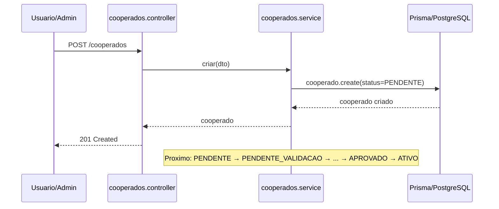

**Ref:** `backend/src/cooperados/cooperados.service.ts`, `schema.prisma:105-145`

### 6.2 Ciclo de Vida do Cooperado

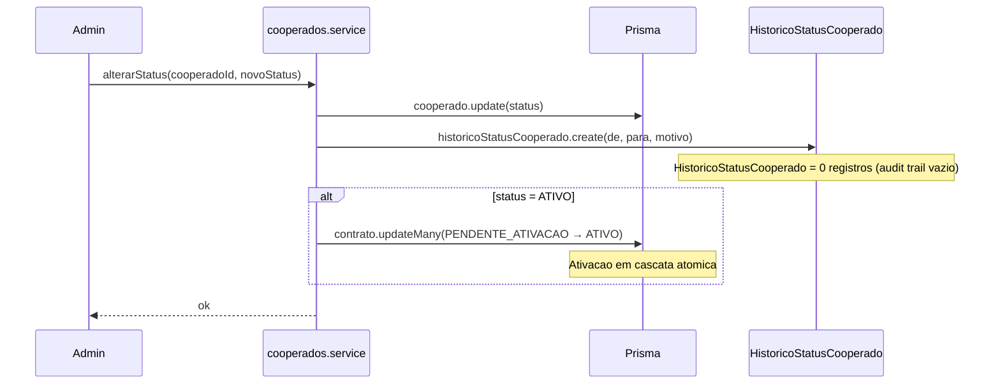

**Ref:** `cooperados.service.ts:722`, `cooperados.service.ts:906-964`, `schema.prisma:221-232`

### 6.3 Cadastro de UC (Unidade Consumidora)

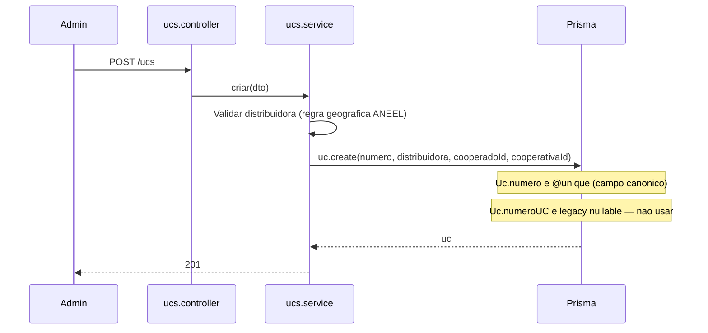

**Ref:** `schema.prisma:271-296`, `faturas.service.ts:38` (resolverUcPorNumero)

### 6.4 Motor de Proposta — Calcular

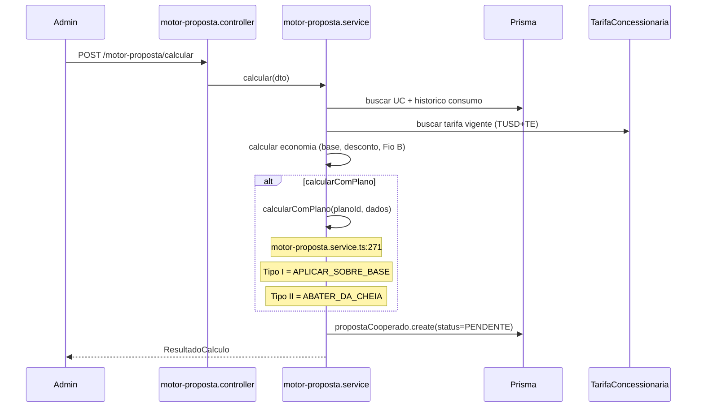

**Ref:** `motor-proposta.service.ts:86` (calcular), `motor-proposta.service.ts:271` (calcularComPlano)

### 6.5 Motor de Proposta — Aceitar

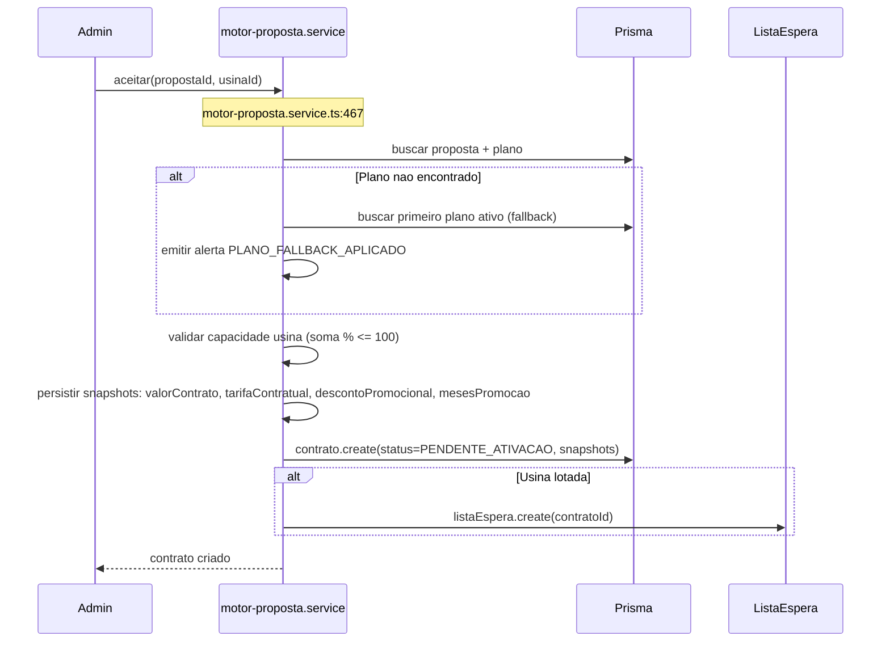

**Ref:** `motor-proposta.service.ts:467`, `motor-proposta.service.ts:548-549` (BLOQUEIO_MODELOS_NAO_FIXO)

### 6.6 Pipeline OCR de Faturas

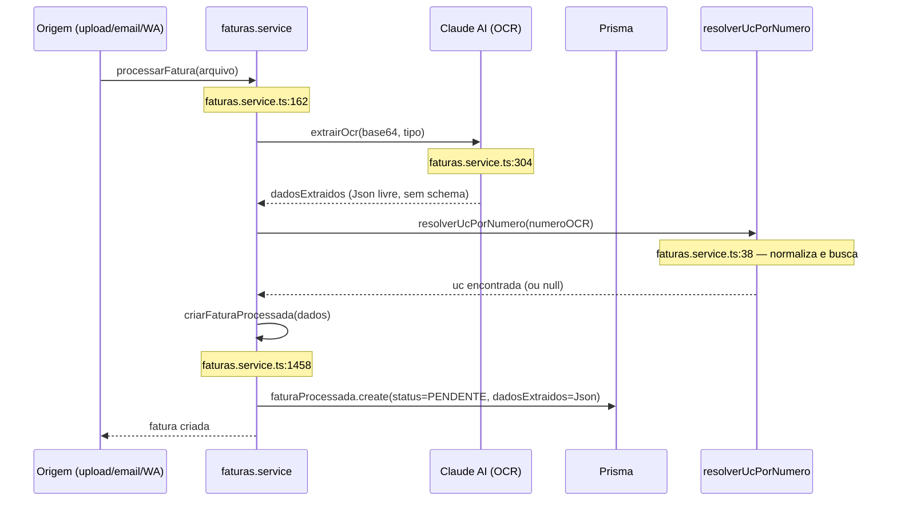

**Ref:** `faturas.service.ts:162`, `faturas.service.ts:304`, `faturas.service.ts:1458`

### 6.7 Pipeline Email → OCR

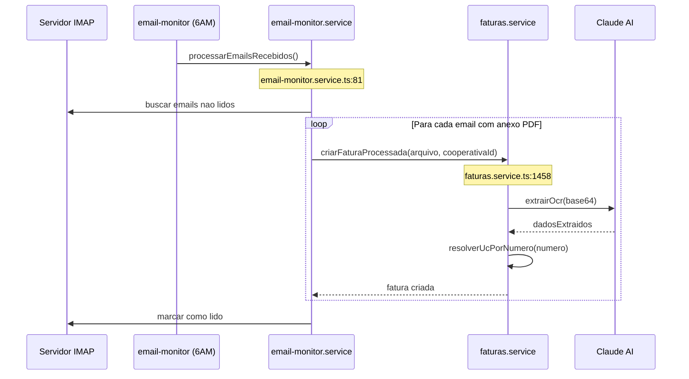

**Ref:** `email-monitor.service.ts:81`, `email-monitor.service.ts:309`

### 6.8 Geracao de Cobranca

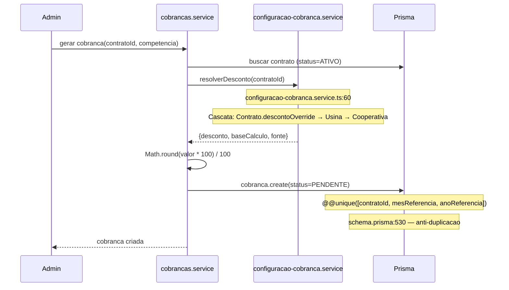

**Ref:** `cobrancas.service.ts`, `configuracao-cobranca.service.ts:60`, `schema.prisma:530`

### 6.9 Ciclo de Cobranca (Vencimento + Multa)

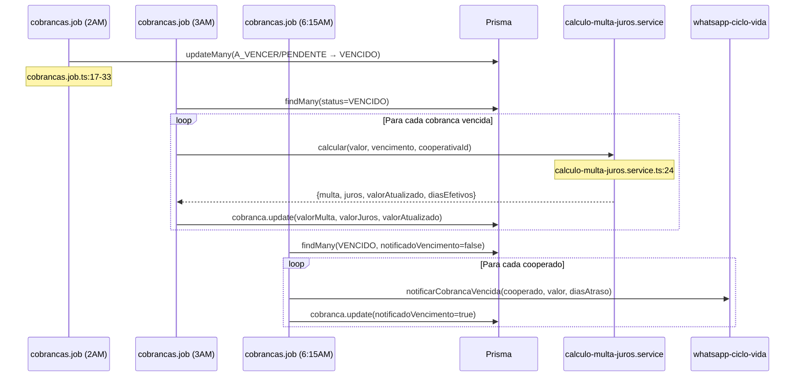

**Ref:** `cobrancas.job.ts:17-173`, `calculo-multa-juros.service.ts:24`

### 6.10 Webhook Asaas (Pagamento)

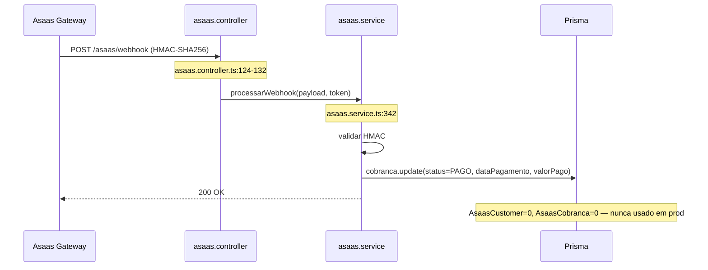

**Ref:** `asaas.controller.ts:124-132`, `asaas.service.ts:342`

### 6.11 Webhook Bancario (BB/Sicoob)

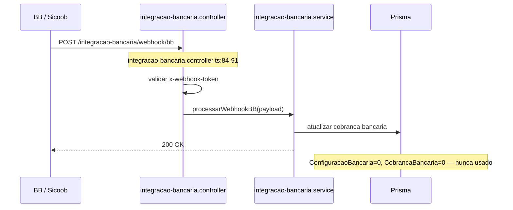

**Ref:** `integracao-bancaria.controller.ts:84-103`

### 6.12 WhatsApp Bot — Envio de Cobrancas

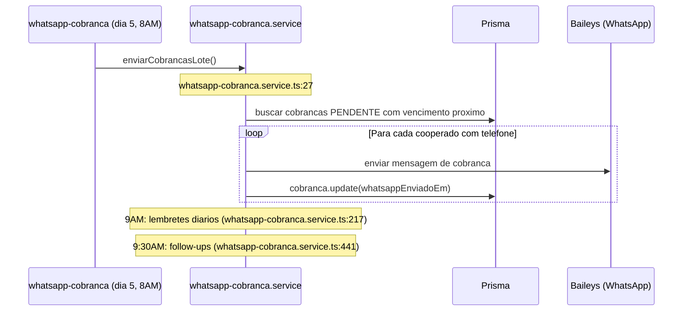

**Ref:** `whatsapp-cobranca.service.ts:27`, `:217`, `:441`

### 6.13 PIX Excedente

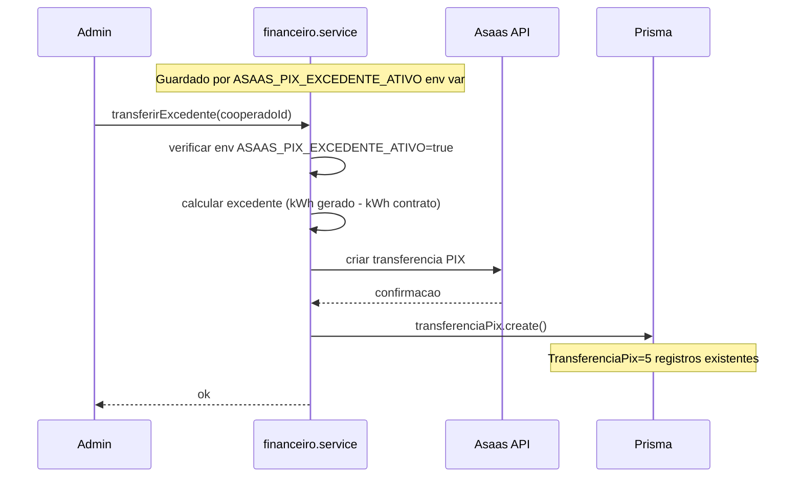

**Ref:** 5 registros em TransferenciaPix. Funcionalidade guardada por env var.

### 6.14 Cascata de Desconto

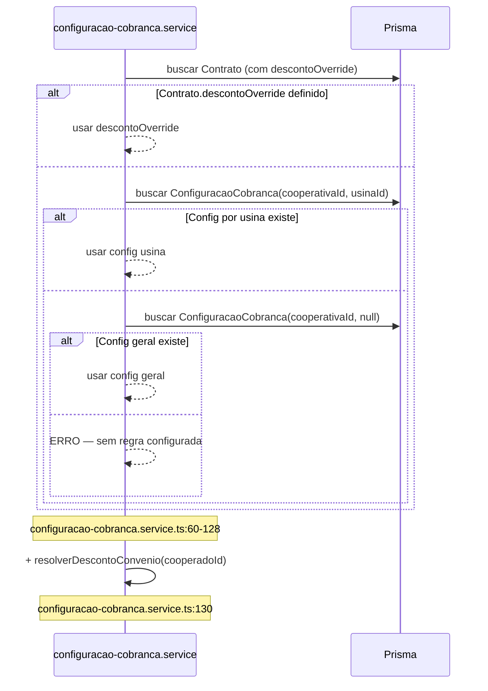

**Ref:** `configuracao-cobranca.service.ts:60-130`, `schema.prisma:827-842`

---

## 7. Lacunas Funcionais (Gaps)

### GAP-01: Faturamento SaaS inexistente
- `PlanoSaas` existe (2 planos), `FaturaSaas = 0`
- Nao existe cron que gere faturas SaaS
- Cooperativas nao sao cobradas. Receita SaaS = R$0
- **Impacto:** sem receita recorrente da plataforma

### GAP-02: Asaas nunca usado em producao
- `AsaasConfig = 1`, mas `AsaasCustomer = 0`, `AsaasCobranca = 0`
- Webhook existe (`asaas.controller.ts:124`), mas nunca recebeu pagamento
- Cooperados pagam por fora (manual) — sem automacao de cobranca real
- **Impacto:** cobrancas existem no sistema mas nao geram boleto/PIX automaticamente

### GAP-03: HistoricoStatusCooperado vazio
- Model existe (`schema.prisma`), codigo de criacao existe (`cooperados.service.ts:722`)
- Mas 0 registros — audit trail nao esta funcionando em todos os caminhos
- **Impacto:** sem rastreabilidade de mudancas de status

### GAP-04: Integracao bancaria (BB/Sicoob) sem configuracao
- `ConfiguracaoBancaria = 0`, `CobrancaBancaria = 0`
- Controllers e webhooks existem (`integracao-bancaria.controller.ts:84-103`)
- Cron de reconciliacao roda diariamente (`integracao-bancaria.service.ts:327`) sem dados
- **Impacto:** infraestrutura bancaria morta

### GAP-05: Monitoramento de usinas sem dados
- `UsinaMonitoramentoConfig = 0`, `UsinaLeitura = 0`, `UsinaAlerta = 0`
- Cron roda a cada minuto (`monitoramento-usinas.service.ts:18`) sem efeito
- **Impacto:** cron desperdicando recursos a cada 60 segundos

### GAP-06: CooperToken e Clube de Vantagens sao esqueletos
- `ConfigCooperToken = 0`, `OfertaClube = 0`, `ResgateClubeVantagens = 0`
- 6 registros no ledger e 3 saldos — provavelmente testes
- Crons rodam diariamente (`cooper-token.job.ts:20,120`) sem efeito pratico
- **Impacto:** features de fidelidade anunciadas mas nao operacionais

### GAP-07: Convenios sem contratos ativos
- `ContratoConvenio = 0`, `ConvenioCooperado = 0`, `HistoricoFaixaConvenio = 0`
- Modulo completo com progressao de faixas implementado
- Cron de reconciliacao roda diariamente (`convenios.job.ts:12`) sem dados
- **Impacto:** feature comercial nao utilizada

### GAP-08: Wizard e Cadastro publico desconectados do Motor de Proposta
- Cadastro publico (`publico.controller.ts`) nao gera PropostaCooperado
- Motor de Proposta requer acao manual do admin para calcular
- **Impacto:** onboarding nao e self-service; admin e gargalo

### GAP-09: Email-recebimento legacy rodando em paralelo com email-monitor
- `email-recebimento.service.ts:26` roda a cada 5min (legacy)
- `email-monitor.service.ts:81` roda 1x/dia as 6AM (novo)
- Dois crons competindo pelo mesmo recurso IMAP
- **Impacto:** possivel duplicacao de processamento ou conflito IMAP

### GAP-10: 5 cooperados orfaos (cooperativaId = null)
- Viola principio fundamental de multi-tenant
- Queries com `where: { cooperativaId }` nunca os encontram
- **Impacto:** dados inacessiveis e potencial fonte de erros

### GAP-11: Contrato legado `calcular()` coexiste com `calcularComPlano()`
- `motor-proposta.service.ts:86` — calcular() legado
- `motor-proposta.service.ts:271` — calcularComPlano() canonico
- Ambos coexistem; legado ainda e chamado por alguns fluxos
- Ticket aberto: docs/sessoes/2026-04-21-tickets-sprint7.md, ticket 3
- **Impacto:** divergencia de resultados entre fluxos

### GAP-12: GeracaoMensal desconectada de Cobranca
- `Cobranca.geracaoMensalId` existe (`schema.prisma:493`) mas nao ha fluxo automatico
- GeracaoMensal = 15 registros, mas Cobrancas nao referenciam
- **Impacto:** cobrancas nao sao baseadas em geracao real

### GAP-13: FaturaProcessada desconectada de Cobranca
- `FaturaProcessada.cobrancaGeradaId` existe (`schema.prisma:614`) mas sempre null
- OCR extrai dados mas nao gera cobranca automaticamente
- **Impacto:** pipeline fatura → cobranca manual

### GAP-14: NPS, Leads e Prestadores vazios
- `NpsResposta = 0`, `LeadExpansao = 0`, `Prestador = 0`
- Funcionalidades criadas mas nunca alimentadas
- **Impacto:** features mortas ocupando espaco no schema

---

## 8. Decisoes Arquiteturais

### DA-01: tipoDesconto enum com duas estrategias
- `APLICAR_SOBRE_BASE`: desconto % sobre base de calculo (TUSD+TE ou componente)
- `ABATER_DA_CHEIA`: abater valor absoluto da conta cheia da concessionaria
- **Ref:** `schema.prisma:450-453`, commit `877d2b7`
- **Impacto:** toda a engine de cobranca precisa suportar ambos os caminhos

### DA-02: BLOQUEIO_MODELOS_NAO_FIXO como env var guard
- Default: `true` (bloqueia COMPENSADOS e DINAMICO)
- Somente FIXO_MENSAL liberado ate conclusao de implementacao
- Presente em 7+ arquivos: `motor-proposta.service.ts:548`, `planos.service.ts:57`, `contratos.service.ts:115`, `faturas.service.ts:500,904`, DTOs
- **Ref:** commit `9174461`
- **Impacto:** 2 de 3 modelos de cobranca estao desabilitados em producao

### DA-03: Uc.numero (canonico) vs Uc.numeroUC (legacy)
- `Uc.numero` e `@unique`, campo canonico — `schema.prisma:273`
- `Uc.numeroUC` e nullable, campo legado — `schema.prisma:277`
- T5 corrigiu email-monitor para usar `numero` — commit `84ad06f`
- **Impacto:** qualquer busca por UC deve usar `numero`, nunca `numeroUC`

### DA-04: Multi-tenant por cooperativaId em toda query Prisma
- Toda query deve filtrar por `cooperativaId` (do JWT)
- SUPER_ADMIN pode ver cross-tenant
- **Ref:** `.claude/rules/multi-tenant.md`
- **Impacto:** cooperativaId nullable em muitos models (`Contrato.cooperativaId String?`) — risco de leak

### DA-05: extrairOcr retorna Json livre (sem schema)
- `FaturaProcessada.dadosExtraidos` e tipo `Json` (`schema.prisma:600`)
- Nao ha validacao de schema nos dados extraidos pelo OCR
- **Ref:** `faturas.service.ts:304`
- **Impacto:** dados OCR podem ter campos faltando, trocados ou inventados sem deteccao

### DA-06: Snapshots de plano no Contrato (freeze at acceptance)
- `aceitar()` copia valores do plano para campos do contrato
- Campos: `valorContrato`, `tarifaContratual`, `descontoPromocionalAplicado`, `mesesPromocaoAplicados`, `baseCalculoAplicado`, `tipoDescontoAplicado`
- **Ref:** `schema.prisma:374-384`, commit `b90cf99`
- **Impacto:** plano pode mudar depois sem afetar contratos existentes

### DA-07: Promocao temporal via dataInicio + mesesPromocaoAplicados
- Contrato armazena quantos meses de promocao foram aplicados
- Engine verifica se ainda esta no periodo promocional
- **Ref:** `schema.prisma:381-382`, commit `67eae97`
- **Impacto:** calculos mensais precisam verificar se promocao expirou

### DA-08: Anti-duplicacao de cobranca
- Guard no codigo + constraint `@@unique([contratoId, mesReferencia, anoReferencia])`
- **Ref:** `schema.prisma:530`, commit `87b3679`
- **Impacto:** impossivel gerar duas cobrancas para mesmo contrato/competencia

### DA-09: calcularComPlano() e canonico; calcular() e legado
- `calcularComPlano()` suporta tipoDesconto, baseCalculo, promocao — `motor-proposta.service.ts:271`
- `calcular()` e a versao antiga sem plano — `motor-proposta.service.ts:86`
- Ambos coexistem; migracao planejada para Sprint 7
- **Impacto:** dois caminhos de calculo divergentes

### DA-10: aceitar() com fallback para primeiro plano ativo
- Se plano da proposta nao encontrado, usa primeiro plano ativo da cooperativa
- Gera notificacao `PLANO_FALLBACK_APLICADO`
- **Ref:** `motor-proposta.service.ts:467+`
- **Impacto:** contrato pode ser criado com plano diferente do esperado

### DA-11: Cascata de desconto em 4 niveis
1. `Contrato.descontoOverride`
2. `ConfiguracaoCobranca(cooperativaId, usinaId)`
3. `ConfiguracaoCobranca(cooperativaId, null)`
4. ERRO
- Plus: `resolverDescontoConvenio` como adicional
- **Ref:** `configuracao-cobranca.service.ts:60-130`

### DA-12: Arredondamento obrigatorio com Math.round
- Todo valor monetario: `Math.round(valor * 100) / 100`
- **Ref:** `.claude/rules/financeiro.md`
- **Impacto:** evita acumulo de erro de floating point

### DA-13: Fio B progressivo (ANEEL) — 60% em 2026
- Percentual por ano: 15% → 30% → 45% → 60% → 75% → 100% (2023-2028)
- **Ref:** `.claude/rules/financeiro.md`
- **Impacto:** desconto real do cooperado diminui a cada ano

### DA-14: PIX Excedente guardado por env var
- `ASAAS_PIX_EXCEDENTE_ATIVO` — default false
- Nao ativar em prod sem instrucao explicita de Luciano
- **Ref:** `.claude/rules/financeiro.md`, 5 transferencias existentes
- **Impacto:** feature existe mas desligada em producao

### DA-15: Regra geografica ANEEL — UC x Usina mesma distribuidora
- UC so pode vincular a usina da mesma distribuidora (`Uc.distribuidora = Usina.distribuidora`)
- Validado em contrato/proposta
- **Ref:** `schema.prisma:281` (Uc.distribuidora), `schema.prisma:312` (Usina.distribuidora)

### DA-16: Percentual de usina calculado e nao livre
- `percentualUsina = kwhContratoAnual / (capacidadeKwh * 12) * 100`
- Soma de todos contratos ATIVO + PENDENTE_ATIVACAO <= 100%
- Validacao sempre com transacao Prisma
- **Ref:** `schema.prisma:302` (capacidadeKwh), `schema.prisma:362` (percentualUsina)

### DA-17: WhatsApp via Baileys (nao API oficial)
- Bot usa library Baileys (conexao direta, nao Business API)
- Estado de conversa persistido no banco
- **Impacto:** risco de ban pelo WhatsApp; sem SLA

### DA-18: cooperativaId nullable em muitos models
- `Contrato.cooperativaId String?`, `Uc.cooperativaId String?`, `Cobranca.cooperativaId String?`
- Permite registros sem tenant — viola principio multi-tenant
- **Ref:** `schema.prisma:370`, `schema.prisma:288`, `schema.prisma:500`
- **Impacto:** queries podem retornar dados cross-tenant se not null check falhar

---

## 9. Armadilhas (Traps)

### TRAP-01: cooperativaId nullable permite orfaos
- 5 cooperados ja existem com `cooperativaId = null`
- Todo `where: { cooperativaId }` ignora esses registros silenciosamente
- Todo `create()` sem cooperativaId cria orfao sem erro
- **Ref:** `schema.prisma:121` (Cooperado.cooperativaId `String?`)

### TRAP-02: Dois crons de email competindo
- `email-recebimento.service.ts:26` (cada 5min, legacy)
- `email-monitor.service.ts:81` (6AM diario, novo)
- Ambos leem da mesma caixa IMAP
- Risco: duplicacao de faturas ou lock IMAP

### TRAP-03: Monitoramento de usinas roda a cada minuto sem dados
- `monitoramento-usinas.service.ts:18` — `@Cron('* * * * *')`
- `UsinaMonitoramentoConfig = 0` — nenhuma usina configurada
- Cron executa 1440x/dia sem efeito, gerando log desnecessario

### TRAP-04: dadosExtraidos do OCR e Json livre
- `FaturaProcessada.dadosExtraidos Json` — sem schema validation
- OCR pode retornar campos inventados, zerados ou trocados (B3 comercial)
- Tickets abertos: Sprint 7 tickets 6, 7, 8
- **Ref:** `faturas.service.ts:304`, `schema.prisma:600`

### TRAP-05: BLOQUEIO_MODELOS_NAO_FIXO espalhado em 7+ arquivos
- Guard repetido manualmente em cada local
- Se alguem adicionar novo local e esquecer o guard, modelos bloqueados passam
- Nao e middleware centralizado
- **Ref:** `motor-proposta.service.ts:548`, `planos.service.ts:57`, `contratos.service.ts:115`, `faturas.service.ts:500,904`, `create-contrato.dto.ts:19`, `update-contrato.dto.ts:19`

### TRAP-06: calcular() legado ainda vivo
- Varias rotas ainda chamam `calcular()` em vez de `calcularComPlano()`
- Resultados divergem: legado nao suporta tipoDesconto nem promocao temporal
- **Ref:** `motor-proposta.service.ts:86` vs `:271`

### TRAP-07: Cooperado.percentualUsina e campo legado
- Existe no model mas documentacao diz "nao usar"
- Codigo pode referenciar por engano
- Campo correto e `Contrato.percentualUsina`
- **Ref:** CLAUDE.md: "Cooperado.percentualUsina e campo legado — nao usar"

### TRAP-08: FaturaSaas nunca gerada — cooperativas nao pagam
- 2 planos SaaS existem (PRATA R$5900, OUTRO R$9999)
- 0 faturas geradas, sem cron de cobranca
- Cooperativa CoopereBR tem plano vinculado mas nunca foi cobrada
- **Impacto:** plataforma opera sem receita

### TRAP-09: Asaas configurado mas nunca usado em prod
- `AsaasConfig = 1` (provavelmente sandbox)
- `AsaasCustomer = 0`, `AsaasCobranca = 0`
- Webhook existe mas nunca recebeu evento real
- Cooperados pagam manualmente (fora do sistema)
- **Ref:** `asaas.controller.ts:124`, `asaas.service.ts:342`

### TRAP-10: Registro "aaaaaaa" como cooperativa ativa
- Cooperativa #5: nome "aaaaaaa", tipo CONDOMINIO, status TRIAL
- 0 cooperados, 0 usinas — lixo de teste
- Aparece em queries cross-tenant do SUPER_ADMIN
- **Impacto:** poluicao de dados; pode confundir em relatorios

### TRAP-11: Rate limit de WA por sleep fixo
- `cobrancas.job.ts:167`: `await new Promise(r => setTimeout(r, 3000 + Math.random() * 2000))`
- Delay de 3-5 segundos entre mensagens — nao e rate limit real
- Baileys pode ser banido pelo WhatsApp se volume crescer
- **Impacto:** escalabilidade limitada

### TRAP-12: TODO em producao — integracao de notificacao pendente
- `whatsapp-fluxo-motor.service.ts:175`: "TODO: integrar com notificacao (email, Slack, etc.)"
- `faturas.service.ts:1685`: "TODO T4b/Sprint7: valorBruto deveria ser valor sem cooperativa"
- **Impacto:** bugs conhecidos documentados como TODO, nao como tickets

### TRAP-13: AsaasConfig.apiKey armazenada em texto plano
- `schema.prisma:1215`: `apiKey String` com comentario "TODO: criptografar com ASAAS_ENCRYPT_KEY"
- Chave API do gateway de pagamento sem criptografia no banco
- **Impacto:** risco de seguranca se banco for comprometido

---

## 10. Tickets Abertos (Sprint 7)

Fonte: `docs/sessoes/2026-04-21-tickets-sprint7.md`

| # | Titulo | Tipo | Impacto |
|---|---|---|---|
| 1 | Auditar tela /dashboard/cooperados/[id] | Auditoria | UI pode mostrar dados incorretos |
| 2 | Bug valorMensalEdp x 0.1 em calcularComPlano() | Bug | Calculo errado no motor de proposta |
| 3 | Refactor/remocao calcular() legado | Refactor | Dois caminhos de calculo divergentes |
| 4 | Bug valorBruto FIXO_MENSAL zerado | Bug | `faturas.service.ts:1685` |
| 5 | Infra E2E Playwright | Infra | Sem testes E2E automatizados |
| 6 | OCR tarifas trocadas B3 comercial | Bug OCR | Tarifas TUSD/TE invertidas |
| 7 | OCR campos inventados/zerados em GD | Bug OCR | Dados fantasma |
| 8 | OCR normalizacao numeroUC e mesReferencia | Bug OCR | Matching incorreto |

---

## 11. Fluxos Financeiros — Estado Real

| # | Fluxo | Direcao | Mecanismo | Status em Prod |
|---|---|---|---|---|
| 1 | Cooperado → Cooperativa | Pagamento de cobranca | Asaas (PIX/boleto) | **NAO OPERACIONAL** — AsaasCustomer=0, pagam por fora |
| 2 | Cooperativa → CoopereBR | SaaS billing | PlanoSaas + FaturaSaas | **NAO OPERACIONAL** — 0 faturas, sem cron |
| 3 | Cooperativa → Dono usina | Arrendamento | ContaAPagar + ContratoUso | **NAO OPERACIONAL** — 0 registros |
| 4 | Cooperativa → Cooperado | PIX excedente | TransferenciaPix via Asaas | **GUARDADO** — 5 registros, env var off |
| 5 | Cooperado → Parceiro | CooperToken | OfertaClube + Resgate | **NAO OPERACIONAL** — 0 registros em tudo |

**Conclusao:** Nenhum fluxo financeiro esta automatizado em producao. Todos os pagamentos sao manuais.

---

## 12. Resumo Executivo

### O que funciona
- Cadastro completo de cooperados, UCs, usinas, contratos
- Motor de proposta com calculo de economia (2 tipos de desconto)
- Pipeline OCR de faturas via Claude AI (8 faturas processadas)
- Bot WhatsApp com 43 conversas e 531 mensagens
- Sistema de cobrancas com multa/juros automaticos (24 crons)
- Multi-tenant com 5 cooperativas cadastradas
- Snapshots de plano em contratos (proteção contra mudanças retroativas)

### O que nao funciona em producao
- **Pagamento automatizado** — Asaas configurado mas zero transacoes
- **Cobranca SaaS** — planos existem, zero faturas geradas
- **Integracao bancaria** — controllers existem, zero configuracao
- **Monitoramento de usinas** — cron roda a cada minuto, zero dados
- **CooperToken / Clube de Vantagens** — esqueletos com dados de teste
- **Convenios** — modulo completo, zero contratos ativos
- **Audit trail** — HistoricoStatusCooperado = 0 registros

### Riscos criticos
1. `cooperativaId` nullable em models core — permite orfaos e leak multi-tenant
2. OCR sem schema validation — dados podem ser inventados
3. AsaasConfig.apiKey em texto plano no banco
4. Dois crons de email competindo pela mesma caixa
5. calcular() legado coexistindo com calcularComPlano() — resultados divergentes
6. BLOQUEIO_MODELOS_NAO_FIXO disperso em 7+ arquivos sem centralizacao
