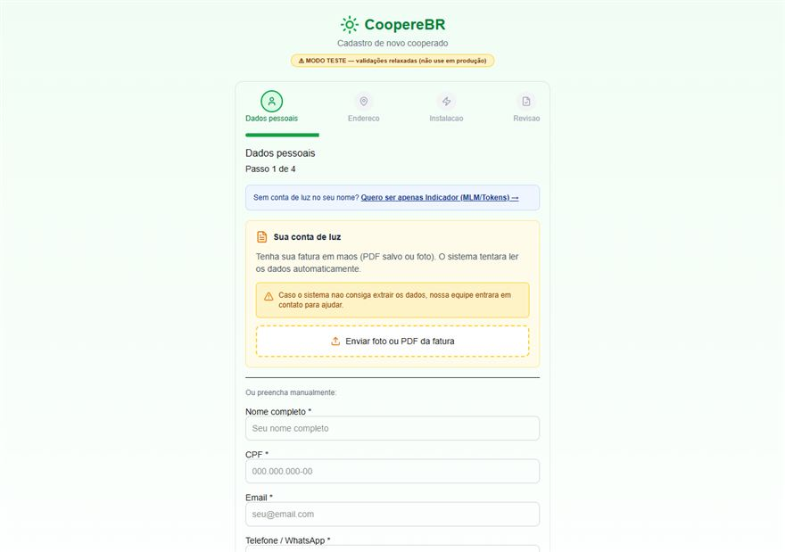
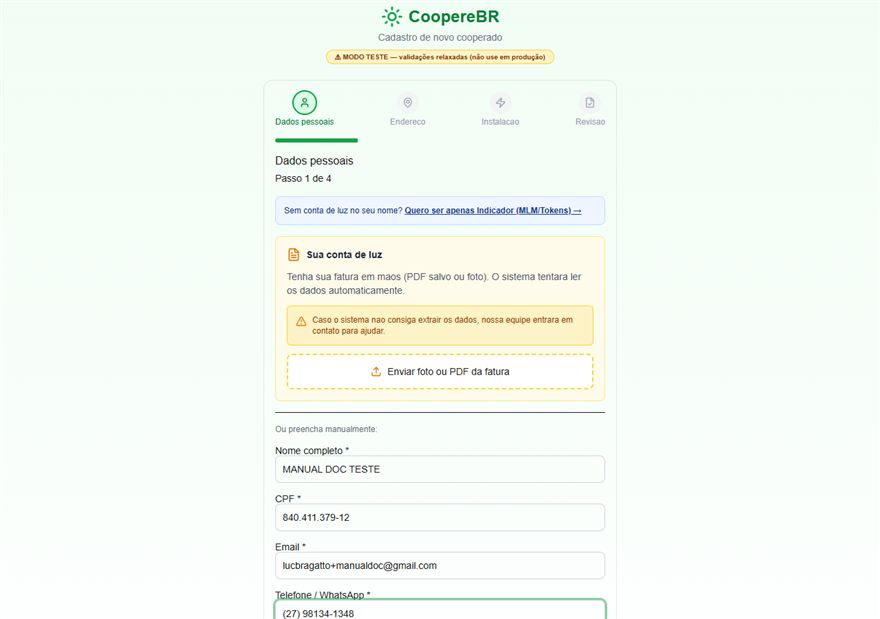
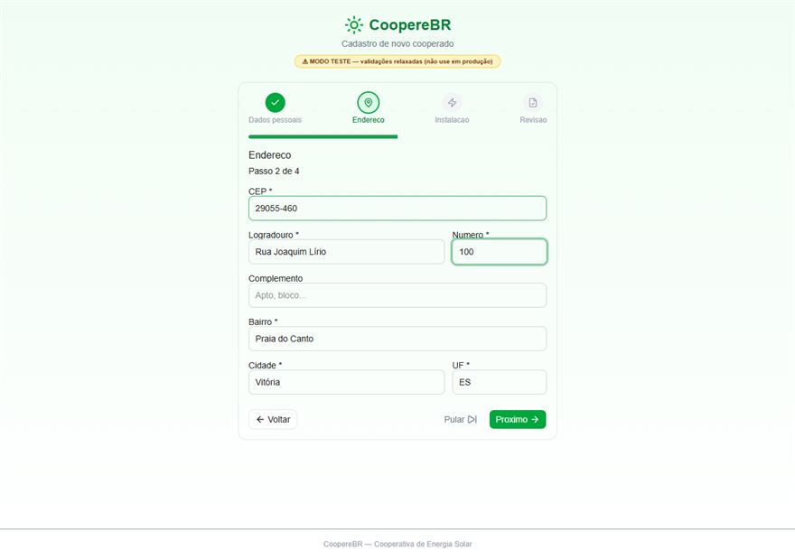
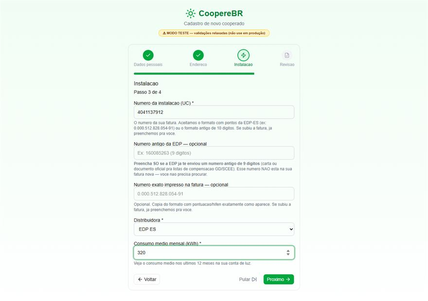
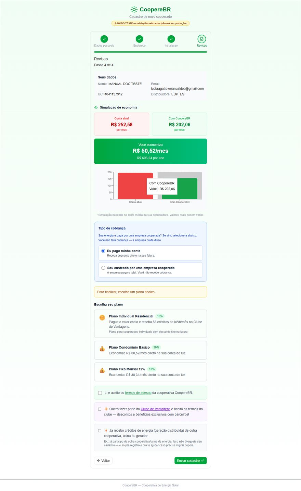
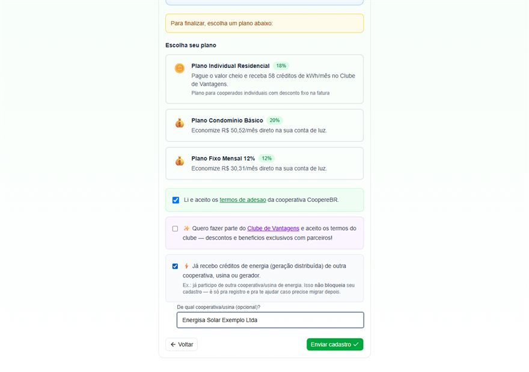
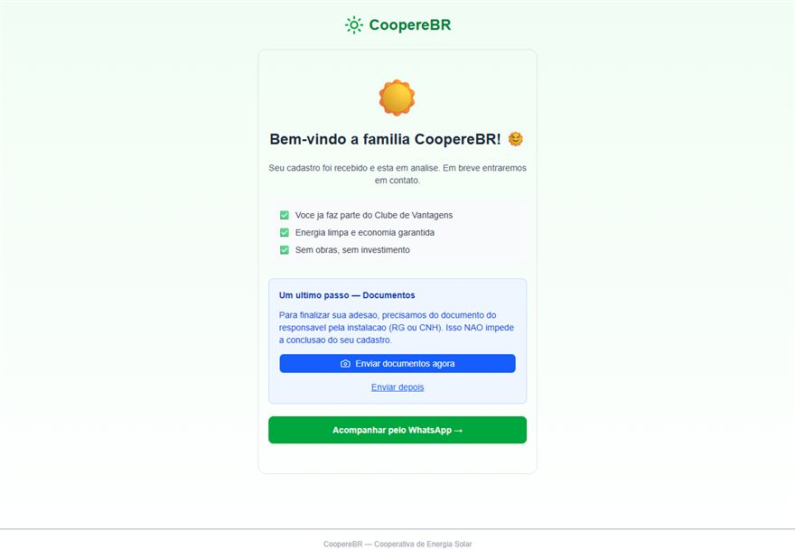
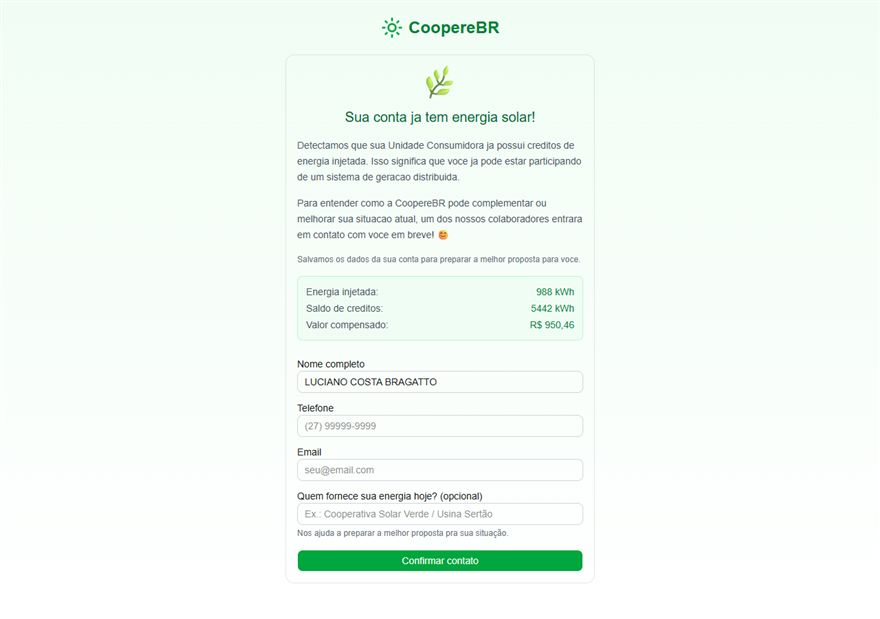
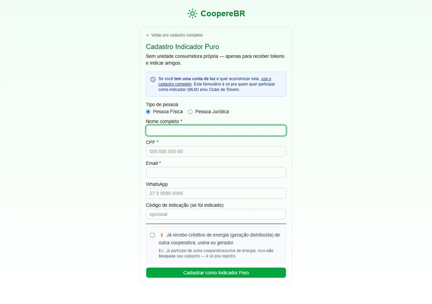

# Manual — Cadastro Público de Cooperado

> Quem usa: pessoa interessada em virar cooperada (chega pelo link do parceiro).
> Endereço: `/cadastro?tenant=<parceiro>` · v1 — 07/07/2026 · prints do ambiente de teste.

## Funções desta tela

- 📷 Leitura automática da fatura (OCR)
- ⌨️ Preenchimento manual (4 passos)
- 🌿 Detecção de energia solar na fatura (fluxo especial)
- 🎯 Declaração "já recebo créditos" + fornecedor (funil de captação)
- 📋 Seleção de plano + simulação
- ✅ Termos de adesão + Clube de Vantagens
- 📎 Documentos (agora ou depois)
- 🤝 Sem conta de luz → Indicador Puro
- 🔗 Indicação via link com código

## Sequência principal

### 1. Passo 1 — Dados pessoais (tela inicial)

A pessoa chega pelo link do parceiro. No topo há o atalho “Quero ser apenas Indicador” (pra quem não tem conta de luz) e a área “Sua conta de luz” — enviando foto ou PDF da fatura, o sistema lê os dados sozinho e preenche o formulário. Quem preferir, preenche manualmente.

### 2. Passo 1 preenchido

Campos obrigatórios: nome completo, CPF, e-mail e WhatsApp. Clique em Próximo.

### 3. Passo 2 — Endereço

Digite o CEP — rua, bairro e cidade são preenchidos automaticamente quando o CEP é encontrado. Complete o número e clique em Próximo.

### 4. Passo 3 — Instalação

Dados da unidade consumidora: número da instalação (como aparece na fatura), distribuidora (ex.: EDP ES) e consumo médio mensal em kWh. Se a fatura foi enviada no Passo 1, tudo isso já vem preenchido.

### 5. Passo 4 — Revisão e plano

Resumo de tudo + escolha do plano (quando o parceiro tem planos públicos), simulação de economia, e os aceites: termos de adesão (obrigatório) e Clube de Vantagens (opcional).

### 6. Passo 4 — Declaração “já recebo créditos”

Se a pessoa já recebe créditos de energia de outra empresa, marca a caixa e informa quem fornece hoje. Isso alimenta o funil de captação: o sistema classifica automaticamente (lead de concorrente, cliente de outro parceiro, etc.) e avisa o admin.

### 7. Tela de sucesso

Cadastro recebido — status inicial PENDENTE, aguardando análise do admin. A pessoa pode enviar os documentos (RG/CNH) na hora ou depois, e acompanhar pelo WhatsApp.

## Fluxos alternativos

### Fluxo especial — fatura já tem energia solar

Se a fatura enviada no Passo 1 mostra créditos de energia injetada, o sistema detecta e troca pra esta tela: mostra os números encontrados (kWh injetado, saldo) e pede só nome/telefone/e-mail + quem fornece a energia — vira um lead de captação pro time comercial, com aviso automático ao admin.

### Fluxo alternativo — sem conta de luz (Indicador Puro)

Pra quem não tem unidade consumidora no próprio nome mas quer participar (indicar amigos, receber tokens). Formulário curto: PF/PJ, nome, CPF, e-mail e WhatsApp.

## Erros comuns

| O que aparece | O que fazer |
|---|---|
| CPF já cadastrado | Falar com o admin — já existe cadastro com esse CPF neste parceiro |
| Página não abre certo | Usar o link oficial completo do parceiro (com ?tenant=) |
| Leitura automática não disponível | Reenviar a fatura ou preencher manualmente |

## Bastidores (pro admin)

Cadastro nasce PENDENTE em `/dashboard/cooperados` com: Origem=Cadastro público (badge 🌐 na Jornada), roteamento do funil (🎯/↪️/❓ + aviso automático ao admin) e dados da fatura no card OCR.
