# Manual — Clube de Vantagens, Convênio e CooperToken

> 3 perspectivas (cooperativa / empresa conveniada / funcionário beneficiário) · v1 07/07/2026.

## O circuito do token

1. Empresa (cooperada PJ) custeia/compra tokens → cooperativa emite cobrança Asaas + taxa 2%.
2. Pago → tokens emitidos pela cooperativa (emissora única).
3. Empresa/cooperativa distribui aos funcionários beneficiários (cooperados).
4. Funcionário abate a própria fatura de energia (ou PIX, ou parceiro QR).
5. Token queimado → passivo baixa. Aporte = ato cooperativo (não venda); receita só no derretimento.

### Perspectiva — Cooperativa (Admin CoopereBR)

Quem opera o convênio, emite os tokens e enxerga o passivo. Área: /dashboard.

**1. Lista de convênios** — Todos os convênios do parceiro (empresa, condomínio, associação). Cada linha mostra empresa, status e nº de membros. É daqui que se cria um convênio novo e se entra no detalhe.

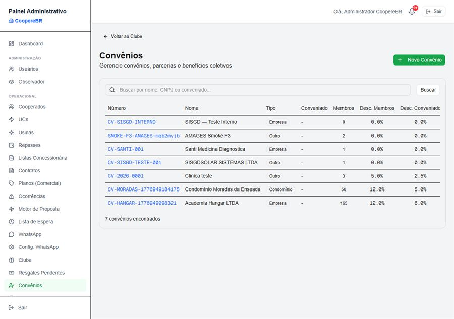

**2. Detalhe do convênio** — Configuração completa: a empresa pagadora, o tipo de benefício (desconto / tokens / misto), a base de custeio (consumo real ou cota fixa), a classificação fiscal (ato cooperativo próprio/auxiliar) e a lista de membros. É aqui que a empresa vira Cooperado PJ e os funcionários são vinculados.

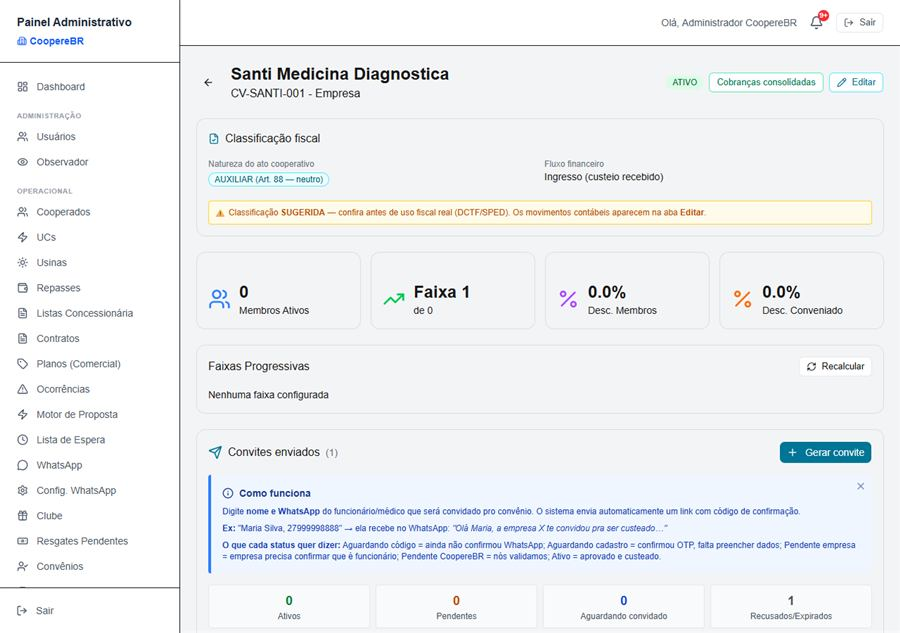

**3. Emissão de CooperToken** — O coração do circuito. Mostra o total emitido, quanto está em circulação (o passivo vivo) e a Emissão Manual de Tokens: busca o cooperado, informa a quantidade e emite. A taxa de emissão de 2% é aplicada automaticamente. Abaixo, o Ledger registra cada movimento.

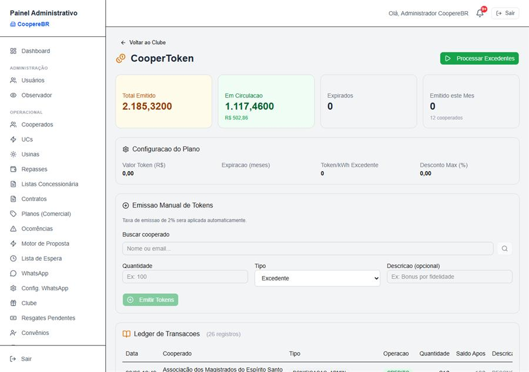

**4. Envio / distribuição em lote** — Distribuir tokens pra vários beneficiários de uma vez — o caminho usado quando a empresa quer entregar o benefício pra toda a equipe.

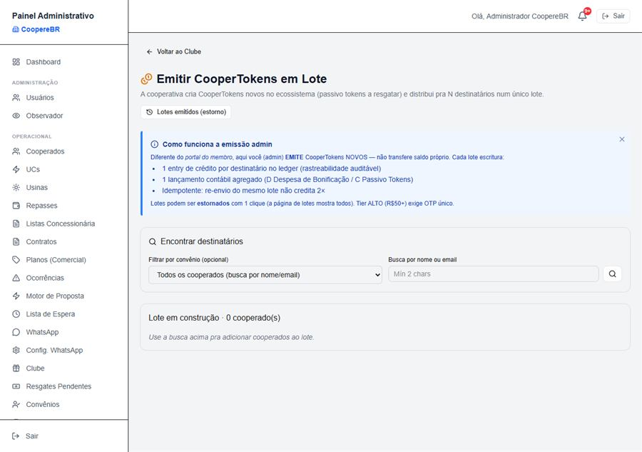

**5. Passivo & Forecast do token** — A visão contábil: quanto a cooperativa "deve" em tokens (o passivo a resgatar), por quem, e a previsão de resgate. É o painel que responde “se todo mundo resgatar, quanto sai do caixa?”.

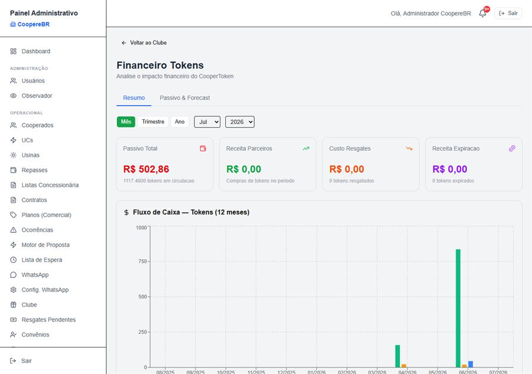

**6. Clube de Vantagens — analytics** — Os níveis (Bronze→Diamante), ranking, distribuição por nível e o funil de conversão. É o painel de engajamento do programa.

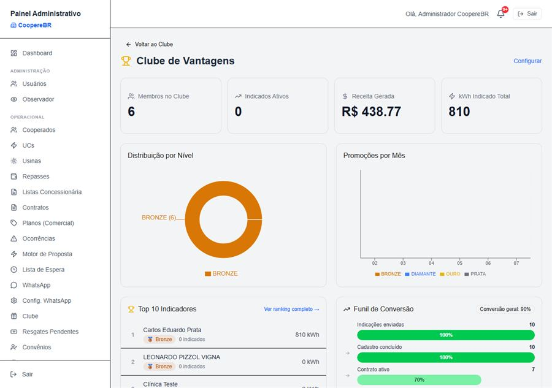

### Perspectiva — Empresa Conveniada (RH / gestor da Santi)

Quem paga o benefício. Faz login como Cooperado PJ e acompanha os seus. Área: /conveniada + /portal.

**1. Painel da conveniada** — A porta de entrada da empresa: seus convênios ativos e os atalhos de gestão dos membros.

**2. Convênio da empresa** — A empresa vê seus funcionários vinculados, o consumo agregado deles (o total de kWh que vira a base do benefício) e aprova novos membros que se cadastraram.

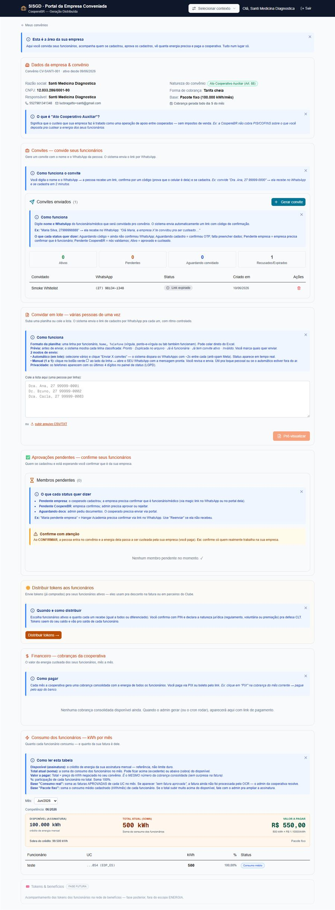

**3. Comprar CooperTokens** — A empresa cooperada compra tokens pra distribuir aos funcionários: informa a quantidade, a cooperativa emite uma cobrança (Asaas), e após o pagamento os tokens caem no saldo. A tela explica a taxa de emissão de 2% — o valor pago é cheio, o saldo recebido já vem líquido.

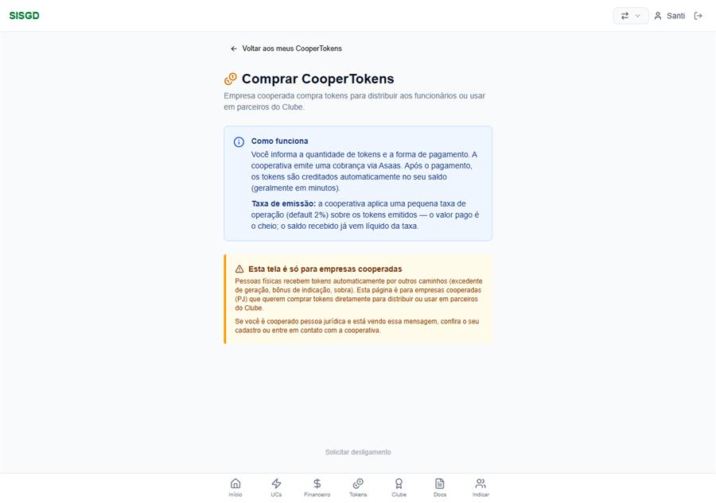

### Perspectiva — Funcionário Beneficiário (cooperado PF)

Quem recebe o benefício e usa os tokens. Faz login no portal. Área: /portal.

**1. Início do portal** — A casa do cooperado: saldo, faturas, atalhos. Simples e voltado pro dia a dia.

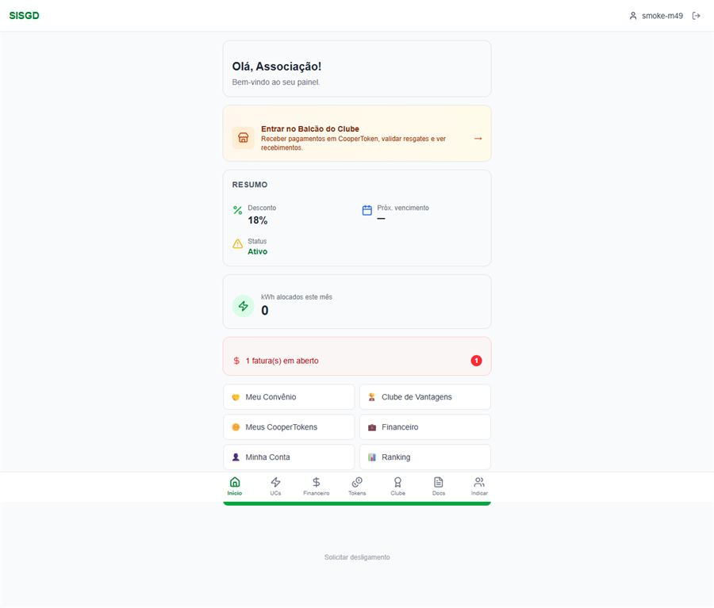

**2. Meus CooperTokens — os 3 caminhos** — A tela central do benefício. Explica o que é o token (vale desconto, não vira dinheiro pra você) e mostra os três destinos: ① Abater a fatura de energia (o principal), ② Resgatar em R$ via PIX (quando aplicável), ③ Pagar em parceiro do Clube via QR Code.

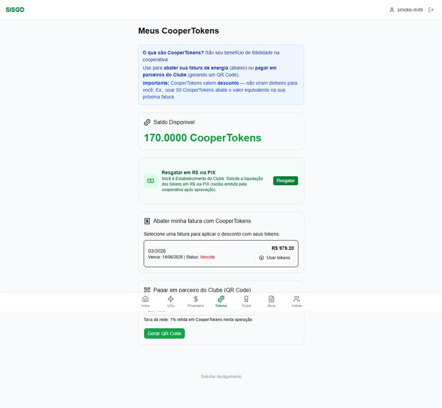

**3. Abater a fatura com tokens** — O passo que fecha o circuito: o funcionário seleciona a fatura em aberto e aplica os tokens — o valor equivalente é descontado da próxima cobrança. É aqui que o benefício vira, na prática, conta de luz mais barata (ou zerada).

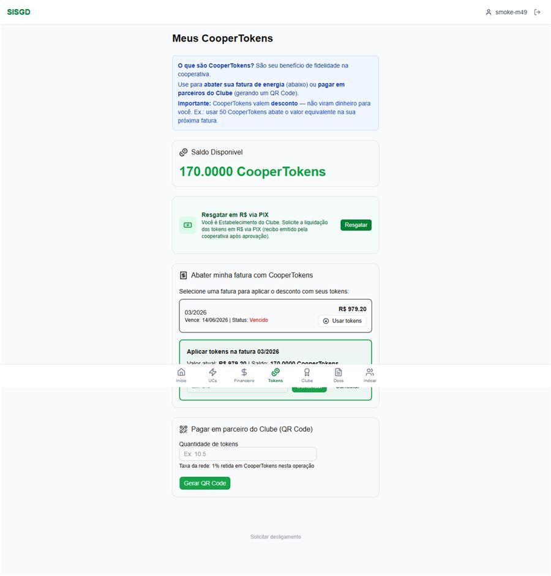

**4. Clube de Vantagens** — O catálogo de ofertas dos parceiros: o cooperado resgata uma oferta com tokens e recebe um código pra apresentar no parceiro.

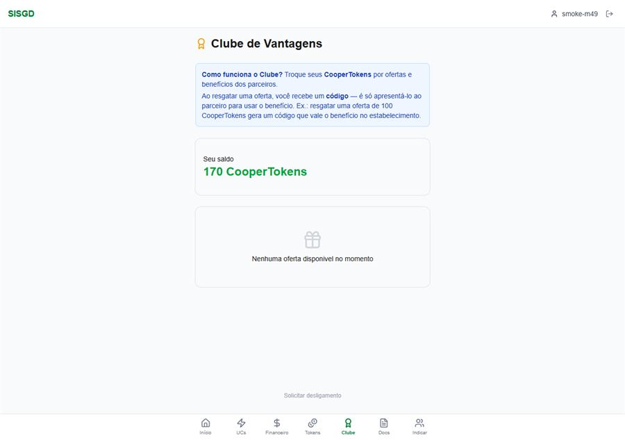

**5. Resgatar por PIX** — Quando disponível, o caminho de transformar token em dinheiro via PIX — pra quem prefere pagar a própria conta por fora.

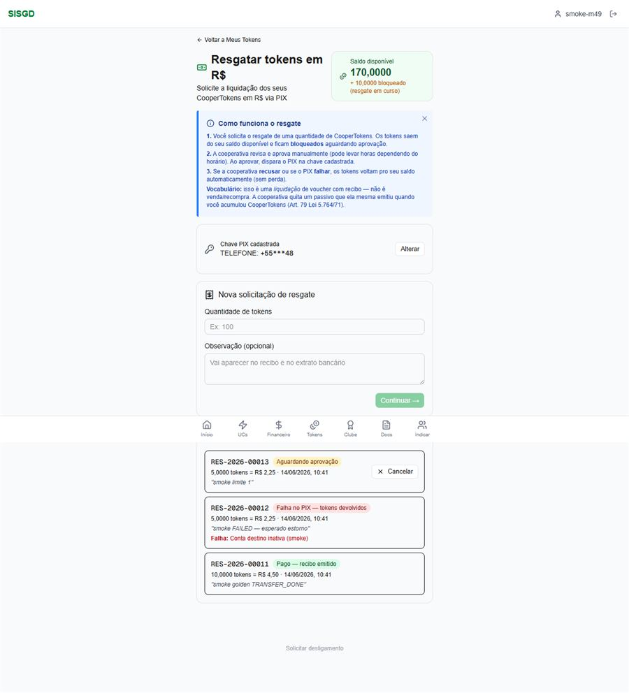

## Importante

CooperToken vale DESCONTO, não é dinheiro na mão. Caminho principal = abate na conta de energia. Cada circulação retém taxa pequena (receita real da cooperativa; o resto é trânsito).
