# Manual — Configuração do Parceiro no SISGD

> Um só operador (admin do parceiro) · v1 15/07/2026. Vale pra qualquer parceiro: CoopereBR, Sinergia e os próximos.

## O que o parceiro configura, na ordem

1. Dados do parceiro + régua de cobrança (multa/juros/carência).
2. Usinas geradoras (capacidade a distribuir).
3. Planos comerciais (desconto + volume que o cooperado assina).
4. Tarifas da concessionária + bandeiras (base de cálculo).
5. Gateway de pagamento (Asaas/BB/Sicoob).
6. Operação: colocar cooperados nas usinas (lista → alocar) + otimizar ocupação (motor).

## 1. Dados do parceiro e régua de cobrança

A identidade do parceiro e as regras de multa/juros que valem pra toda cobrança. Área: /dashboard/configuracoes.

**1. Configurações gerais** — A porta de entrada. Dados do parceiro (nome, CNPJ, e-mail, endereço), Tipo de Operação (usina própria em GD, condomínio por rateio, empresa comercial, carregador veicular — dá pra marcar mais de um) e Multa e Juros padrão. É aqui que cada parceiro — CoopereBR, Sinergia, qualquer outro — se identifica no sistema.

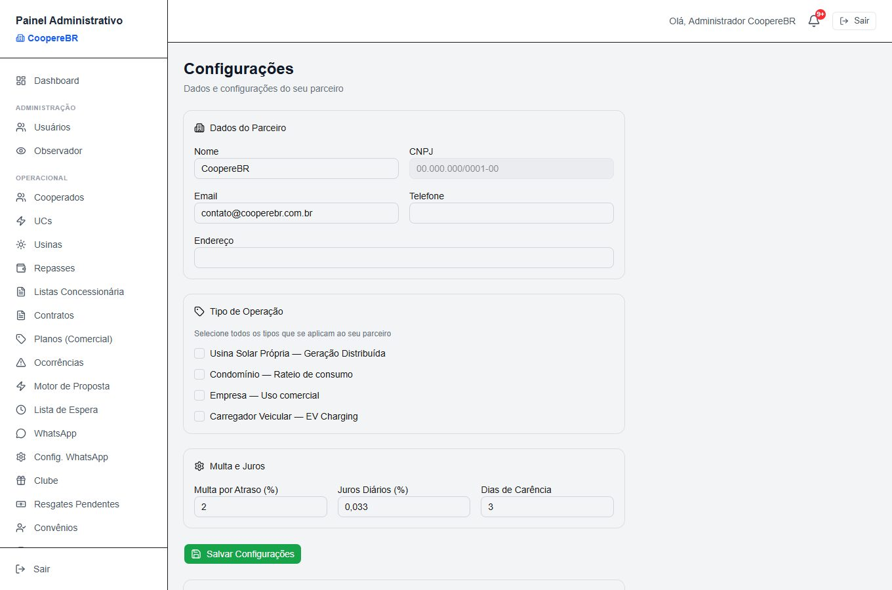

**2. Régua de cobrança** — A régua dedicada de inadimplência: multa por atraso (padrão 2%), juros diários (0,033%/dia ≈ 1%/mês) e dias de carência antes de aplicar (padrão 3). Vale pra todas as faturas do parceiro.

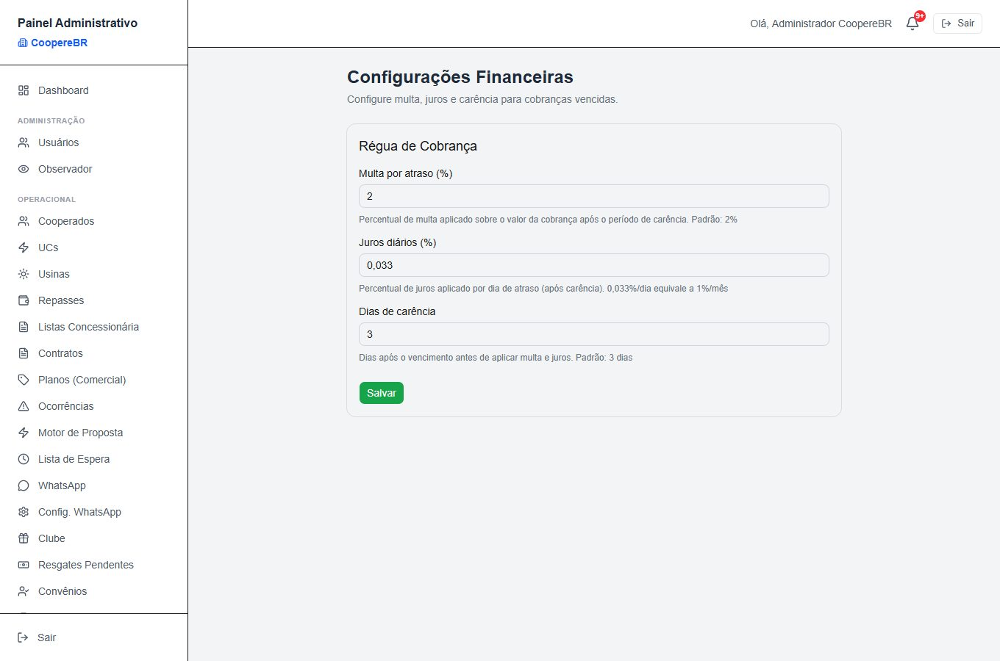

## 2. Usinas geradoras

A capacidade de geração que será distribuída aos cooperados. Área: /dashboard/usinas.

**1. Lista de usinas** — Todas as usinas do parceiro com potência (kWp), capacidade mensal (kWh), proprietário, cidade e status de homologação (Em Produção / Homologada / Aguardando Homologação). É daqui que se cadastra uma nova ou se entra no detalhe de cada uma.

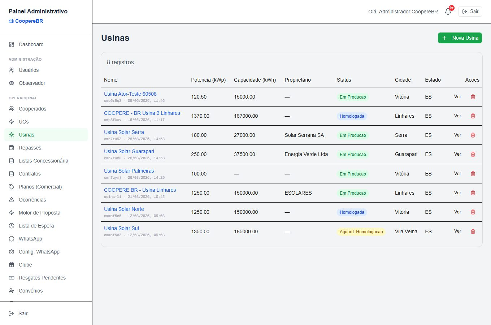

**2. Nova usina — o cadastro completo** — Cerca de 28 campos: razão social ANEEL e apelido interno, potência instalada, capacidade e produção mensal, Classe GD (regulatório — GD I/II/III), status e datas de homologação e produção, localização completa, distribuidora, CNPJ do titular e a forma de pagamento do dono da usina (valor fixo, percentual da geração, ou híbrido). Repare no aviso do próprio sistema sob a Classe GD — ele já sinaliza o que ainda está por vir (ver caixa "Em desenvolvimento" no fim).

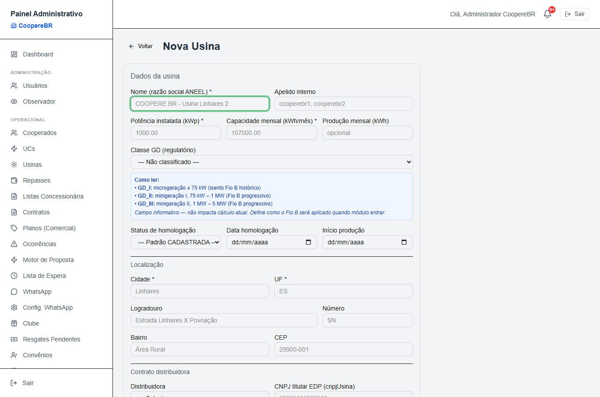

## 3. Planos comerciais

O que o cooperado assina — o desconto e o volume de energia. Área: /dashboard/planos.

**1. Lista de planos** — Os planos comerciais oferecidos na captação. Cada linha traz o desconto e o modelo de cobrança. É o catálogo que aparece pro futuro cooperado.

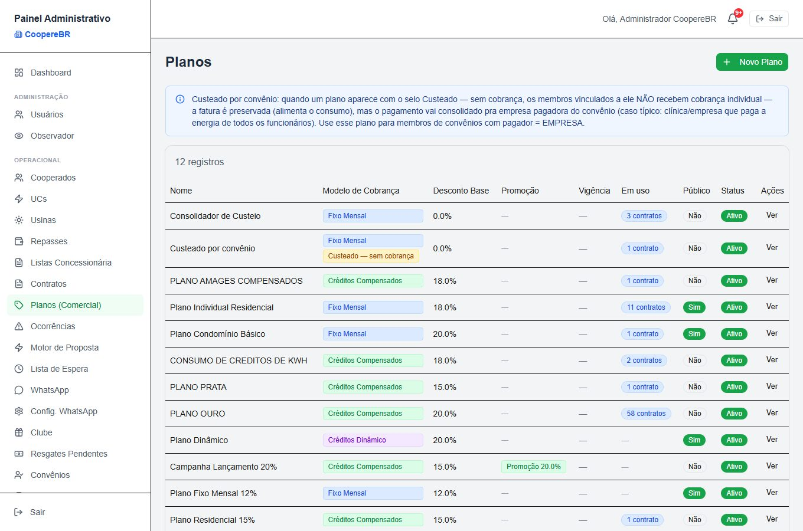

**2. Novo plano — com simulação ao vivo** — Nome, modelo de cobrança (hoje Fixo Mensal), desconto base % (o desconto que o motor de proposta aplica), kWh contratado/mês, se o plano é público (visível na captação) e a base de cálculo. O painel à direita simula a economia em tempo real — valor mensal, economia mensal e projeção de 1, 5 e 15 anos — batendo com o backend.

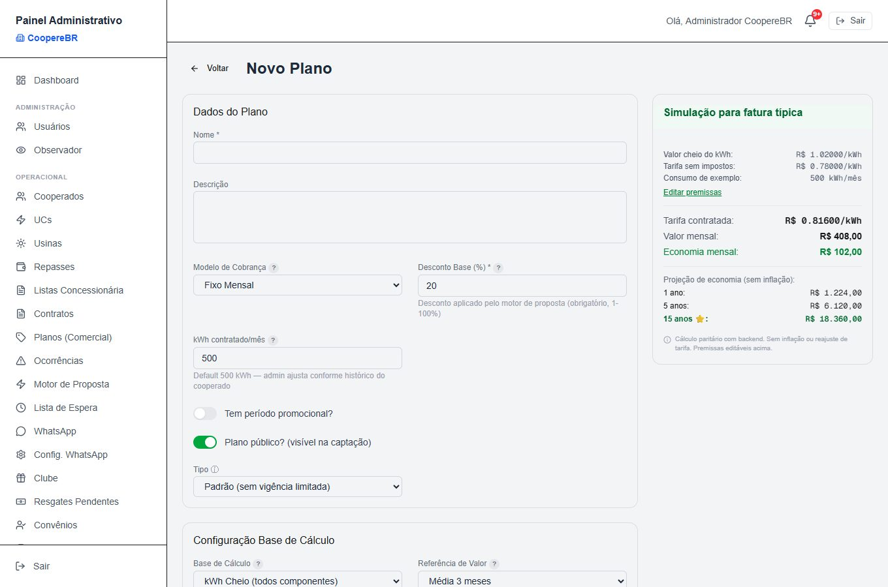

## 4. Tarifas e bandeiras (a base de cálculo)

Os números da concessionária que alimentam toda fatura. Área: /dashboard/motor-proposta/tarifas e /configuracoes/bandeiras.

**1. Tarifas da concessionária** — A TUSD e a TE (anterior e nova) por vigência, com os percentuais anunciado / apurado / aplicado. É o dado homologado da distribuidora (aqui, EDP-ES) que serve de base pro cálculo de economia e cobrança.

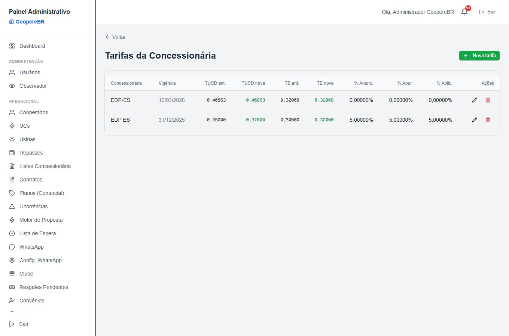

**2. Bandeiras tarifárias** — O custo extra por bandeira (amarela/vermelha) aplicado às cobranças mensais. Dá pra ligar/desligar a aplicação, ativar a sincronização automática com a ANEEL (busca a bandeira vigente no dia 1º) ou consultar a bandeira atual sob demanda. A verde não gera custo extra.

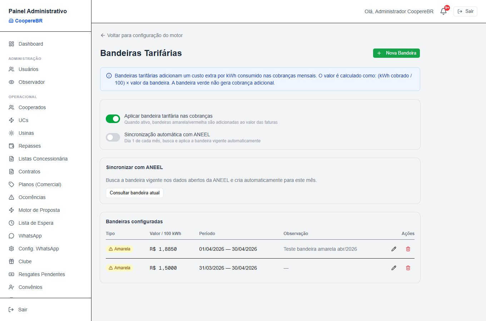

## 5. Gateway de pagamento

Como o parceiro cobra de verdade — boleto, PIX, cartão. Área: /dashboard/configuracoes/asaas.

**1. Integração Asaas (e demais gateways)** — As credenciais do gateway: escolha de ambiente (Sandbox de teste × Produção), a API Key (guardada criptografada — só aparece mascarada), o token do webhook e um botão Testar Conexão. O sistema também suporta BB, Sicoob e Banestes pelo mesmo padrão. É o que liga o parceiro ao dinheiro entrando.

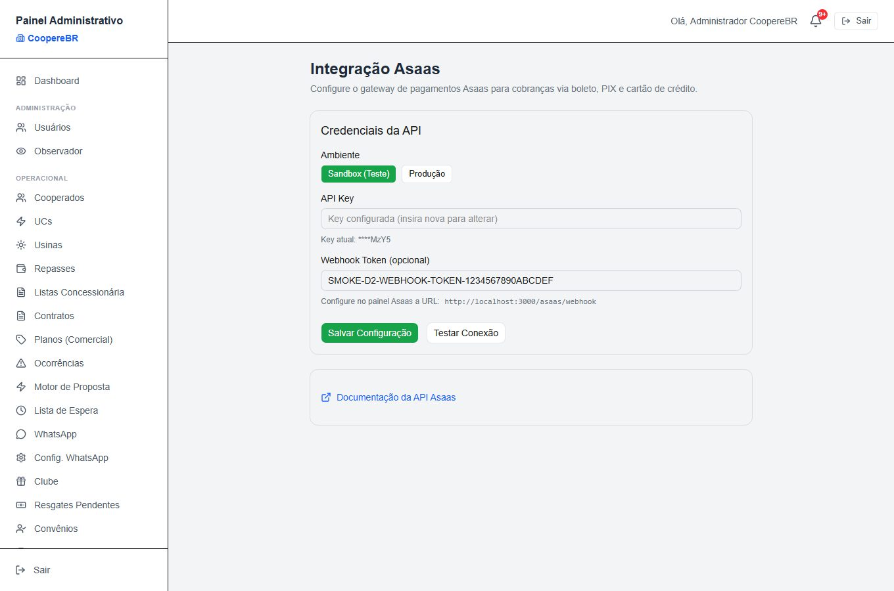

## 6. Colocar cooperados nas usinas

A operação viva: encaixar cada cooperado numa usina e manter a ocupação boa. Área: /dashboard/motor-proposta/lista-espera e /parceiro/alocacao.

**1. Lista de espera → Alocar** — A fila de cooperados aprovados que ainda aguardam vaga numa usina. Quando há gente na fila, cada linha ganha o botão Alocar, que coloca o cooperado numa usina com espaço. É este o ponto de partida da colocação — o fluxo "acionado pelas listas": o admin trabalha a lista pra encaixar as pessoas. (Na captura, a fila está vazia — estado normal quando todos já foram alocados.)

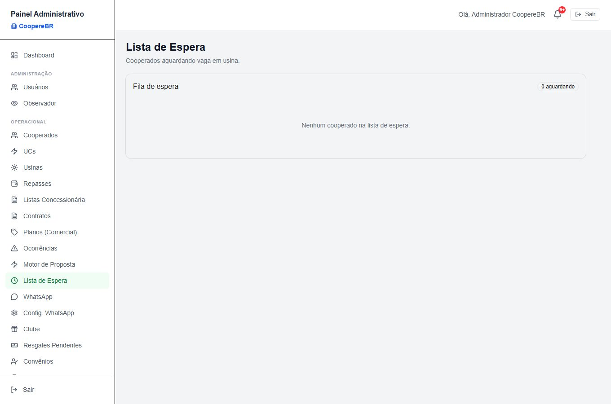

**2. Alocação Multi-Usina (otimização)** — A visão de ocupação de todas as usinas (% ocupada, capacidade, classe GD) em três abas: Estado atual, Sugestões (um motor propõe realocações pra melhorar o encaixe) e Políticas. Roda sozinho por rotina mensal e sob demanda no botão Simular realocação. As mudanças sugeridas são aplicadas caso a caso pelo admin — nada muda de usina sem confirmação. Este motor é separado da lista de espera: a lista coloca quem está esperando; o motor otimiza quem já está dentro.

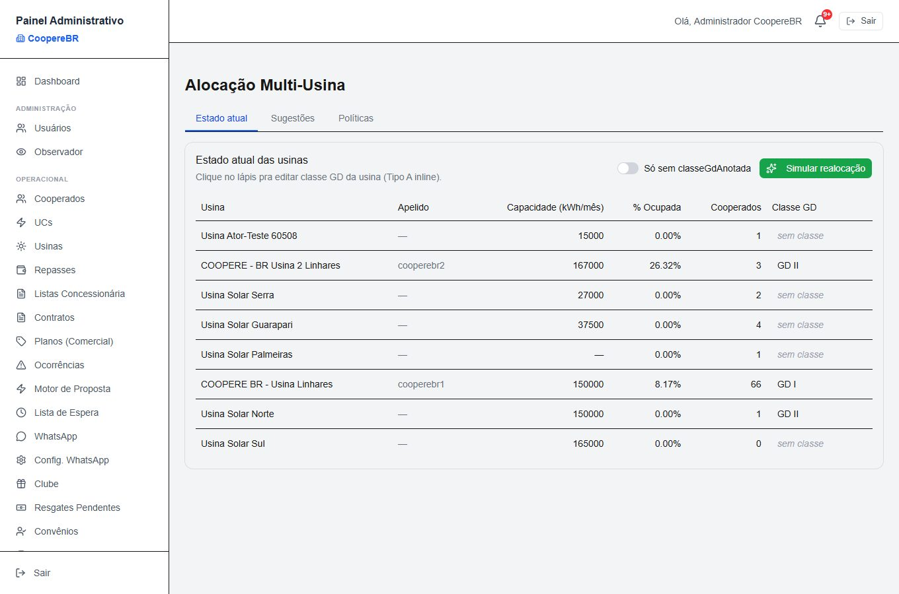

## 🚧 Em desenvolvimento (previsto, ainda não ativo)

1. **Troca automática de pares** — o motor sugere realocações, mas a busca de swap de pares é um espaço reservado; encaixe fino é manual.
2. **Previsão GD II/III** — o campo Classe GD existe mas é informativo: "não impacta cálculo atual. Define como o Fio B será aplicado quando o módulo entrar."
3. **Fio B progressivo** — cobrança progressiva do Fio B ainda não implementada; entra junto com a previsão GD II.
