# Manual — O Dono de Usina (Proprietário)

> 2 lados (admin do parceiro × portal do dono) · v1 15/07/2026. Exemplo: COOPERE BR — Usina Linhares, dono E-Solares, pagamento fixo R$ 1.000/mês.

## A relação parceiro ↔ dono, do início ao fim

1. Admin cadastra a usina + forma de pagamento ao dono (fixo/%/híbrido) + matriz de responsabilidade.
2. Geração mensal (kWh) registrada → sistema calcula o repasse.
3. Despesas lançadas, cada uma com um tratamento.
4. Despesas "desconto no repasse" abatem o valor do dono; admin marca pago.
5. Dono acompanha no portal: geração, repasses (bruto→abatido→líquido), despesas.

## As duas situações de despesa

- **Descontada do dono pelo parceiro** (DESCONTO_NO_REPASSE): o parceiro pagou e abate do repasse do dono.
- **Paga pelo próprio dono** (responsável PROPRIETARIO, ASSUMIDO): despesa do dono, não mexe no repasse.

Quem define de quem é cada categoria é a Matriz de Responsabilidade.

## ① O admin do parceiro configura e opera

### Admin do parceiro (configura e opera)

Quem cadastra a usina, define como o dono é pago, lança as despesas e efetua o repasse. Área: /dashboard/usinas.

**1. Painel da usina** — A ficha da usina: capacidade, status de homologação, dados técnicos e os atalhos pras telas do dono (cadastro/edição, configuração do proprietário, despesas e repasses). É o ponto de partida de tudo que envolve aquela usina e seu dono.

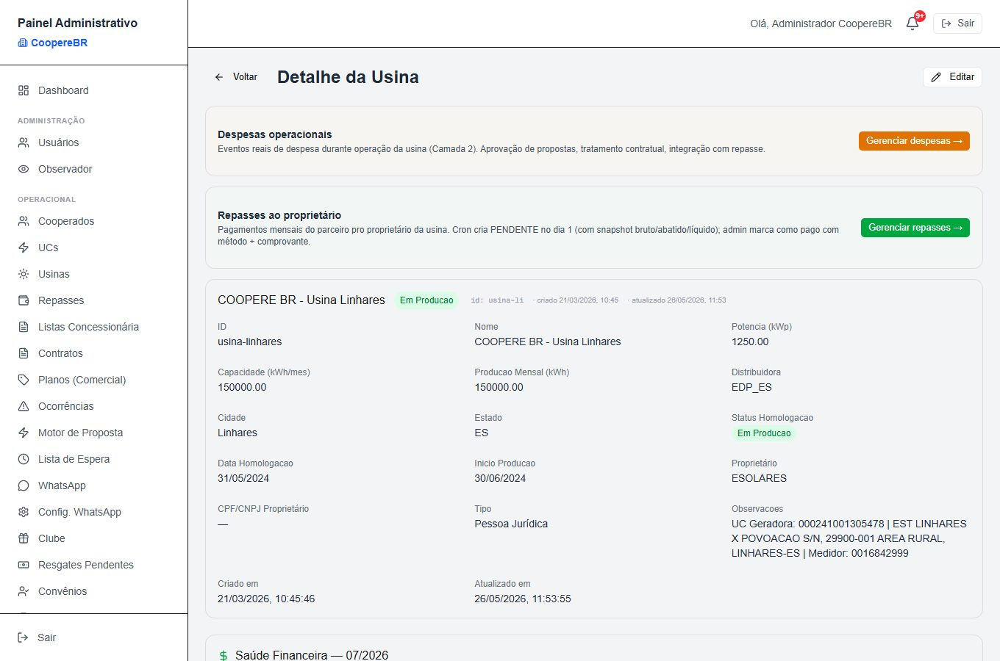

**2. Cadastro — forma de pagamento ao dono** — No cadastro/edição da usina define-se como o dono recebe: Fixo (aluguel/cessão em R$/mês), Percentual (uma fatia da geração, em % × tarifa × kWh gerado) ou Híbrido (fixo + percentual). No exemplo, a Usina Linhares paga fixo de R$ 1.000/mês. Aqui também ficam os dados do proprietário (nome, CPF/CNPJ, e-mail — o e-mail é o que dá acesso ao portal dele).

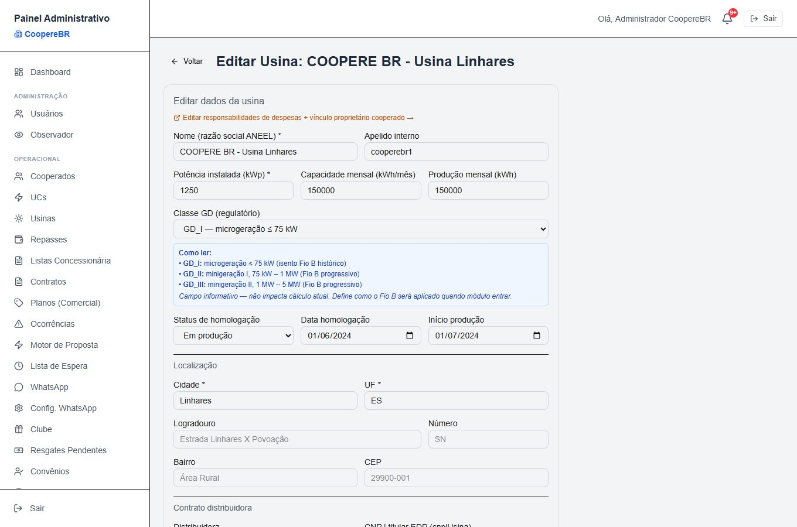

**3. Configuração do proprietário** — Três ajustes que alimentam o portal do dono: o status operacional da usina (operando / manutenção / offline), a tarifa de referência (valorKwhPadrao, que substitui a tarifa da distribuidora no cálculo percentual) e — o mais importante pra despesas — a Matriz de Responsabilidade: define, por categoria (CUSD, roçada, seguro, IPTU, manutenção…), quem é o responsável contratual: o parceiro, o proprietário, ou compartilhado.

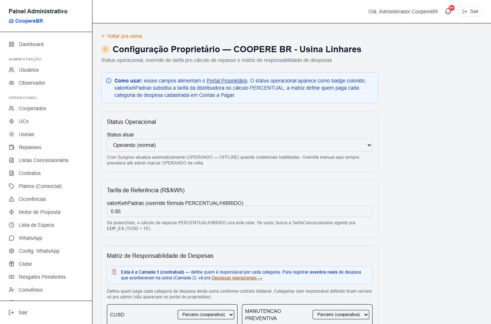

**4. Despesas operacionais — os dois casos lado a lado** — Cada evento real de despesa da usina, com as duas colunas que respondem sua pergunta: Tratamento (como é acertada) e Quem pagou. Repare: as duas CUSD estão como “DESCONTO NO REPASSE” e quem pagou foi o PARCEIRO — são despesas que o parceiro adiantou e vai abater do repasse do dono. Já o IPTU/ITR e a manutenção corretiva estão como “ASSUMIDO” e quem pagou foi o PROPRIETÁRIO — despesas do próprio dono, que não mexem no repasse. O dono pode propor despesas pelo portal; o admin aprova/rejeita aqui.

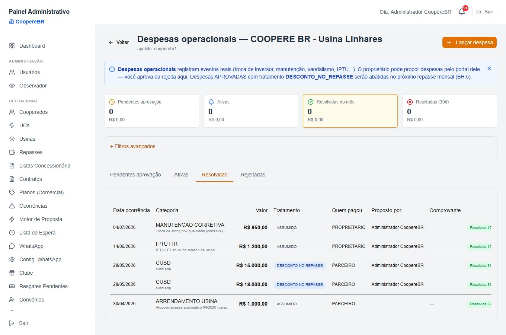

**5. Repasses ao dono — bruto → abatido → líquido** — O acerto mensal. Uma rotina cria o repasse refletindo o pagamento do mês, descontando as despesas marcadas “desconto no repasse” do período. A tabela mostra as três colunas que importam: Bruto (o que o dono receberia), Despesas abatidas e Líquido (o que ele recebe de fato). No exemplo de junho: bruto R$ 1.000 − despesas R$ 33.000 = líquido R$ 0 (nunca fica negativo). O admin marca como pago (com método, data e comprovante) — e isso resolve as despesas abatidas automaticamente. Dá pra estornar, revertendo tudo.

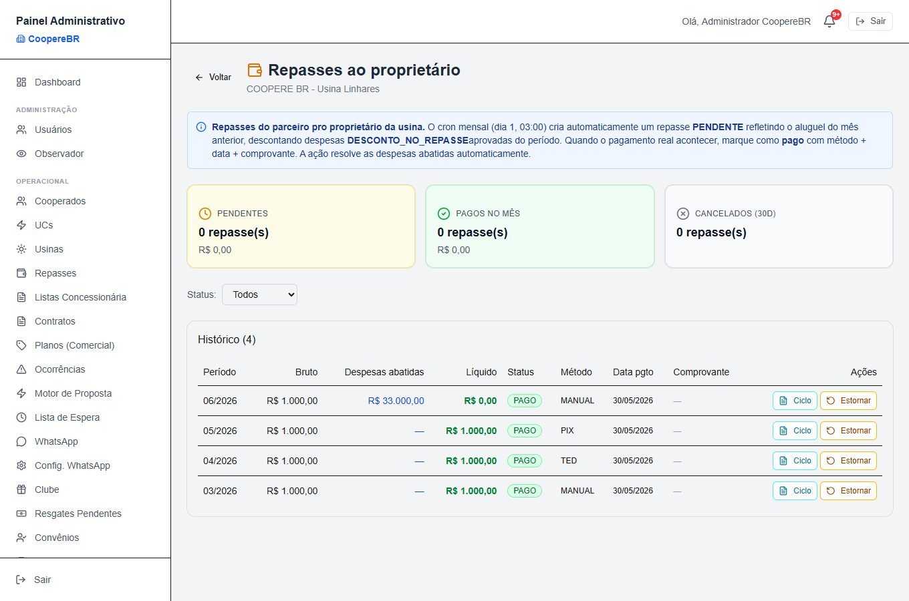

**6. Repasses — visão global** — A mesma operação, mas consolidando todas as usinas do parceiro num lugar só — pra quem administra vários donos ao mesmo tempo.

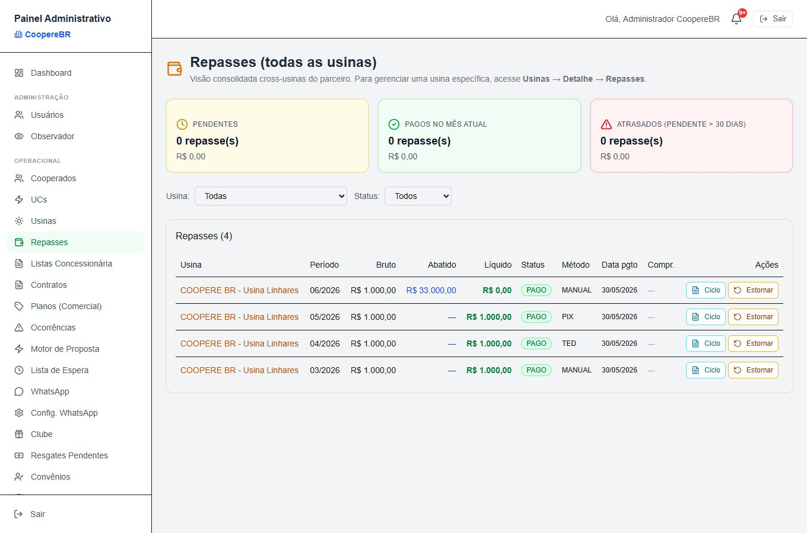

## ② O dono acompanha no portal dele

### Dono da usina (portal próprio)

O proprietário faz login e acompanha suas usinas, o que vai receber e as despesas que o tocam. Área: /proprietario.

**1. Dashboard do proprietário** — A visão consolidada: quanto vai receber esse mês, o total acumulado no ano, o status técnico das usinas e os contratos a vencer — mais um card por usina com geração do mês, repasse previsto e ocupação. Tudo em linguagem de dono, sem jargão do parceiro.

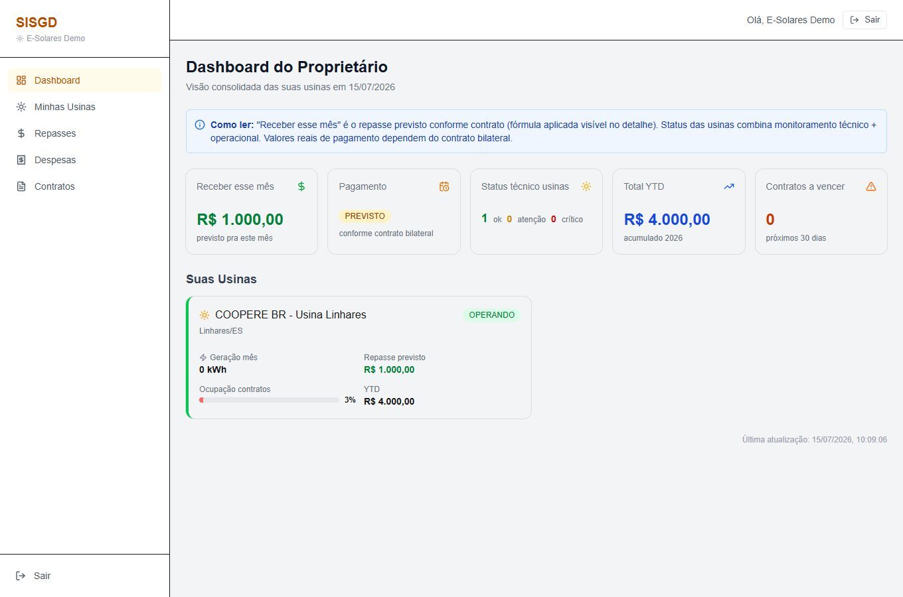

**2. Minhas usinas** — A lista das usinas que pertencem a ele, com acesso ao detalhe de cada uma.

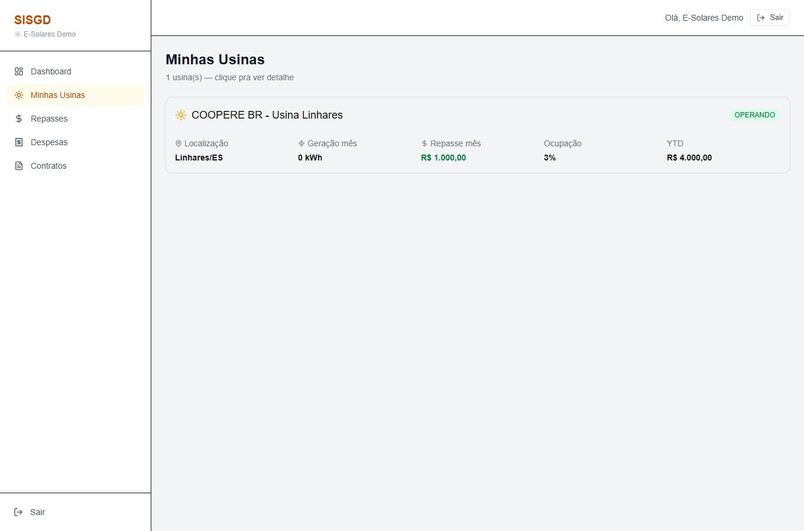

**3. Detalhe da usina** — O drill-down: gráfico de geração dos últimos 12 meses, histórico de repasses conforme o contrato, contratos vinculados e alertas de monitoramento. Os cooperados aparecem anonimizados (LGPD — “Cooperado #001”). Dá pra baixar um PDF do mês.

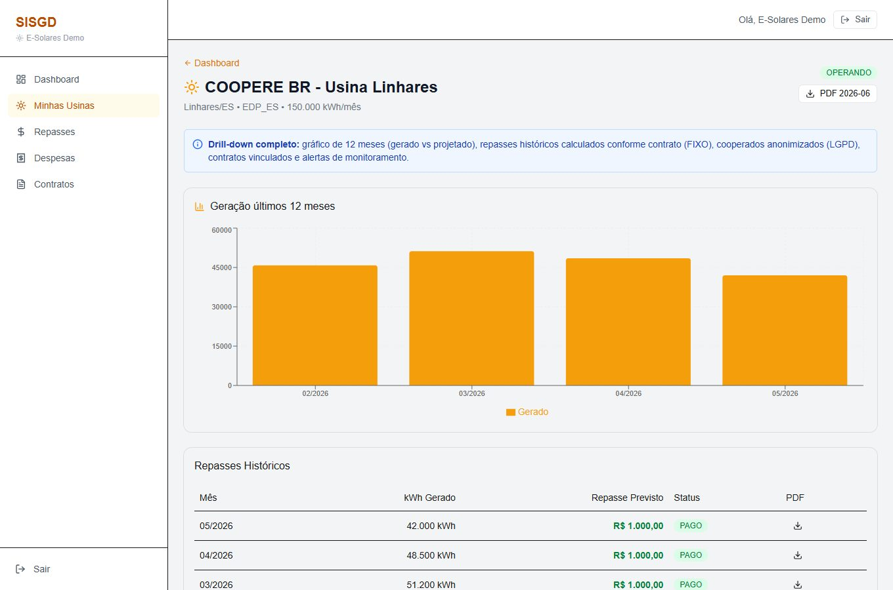

**4. Repasses recebidos** — O extrato do que o dono recebe: por período, o kWh gerado, o valor previsto, o valor pago e o status. Meses já quitados aparecem como PAGO; o mês corrente aparece como previsto até o admin registrar o pagamento real.

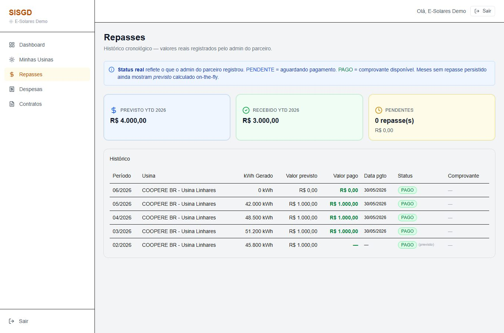

**5. Minhas despesas — os dois casos, do lado do dono** — A mesma história das despesas, agora pela ótica do dono. Ele vê as despesas com tratamento “DESCONTO NO REPASSE” (que vão abater o próximo repasse dele) e as “ASSUMIDO” (as que ele mesmo paga, como o IPTU e a manutenção corretiva). O aviso no topo é explícito: “despesas com tratamento desconto no repasse serão abatidas no seu próximo repasse mensal.” Transparência total: nada é abatido sem ele ver.

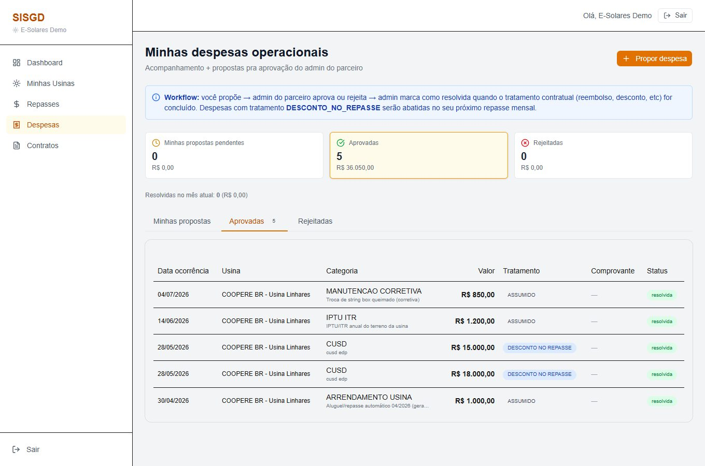

**6. Contratos da usina** — Os contratos dos cooperados alocados na usina do dono — sempre com identidade anonimizada por LGPD. O dono vê o volume e a ocupação, não os dados pessoais.

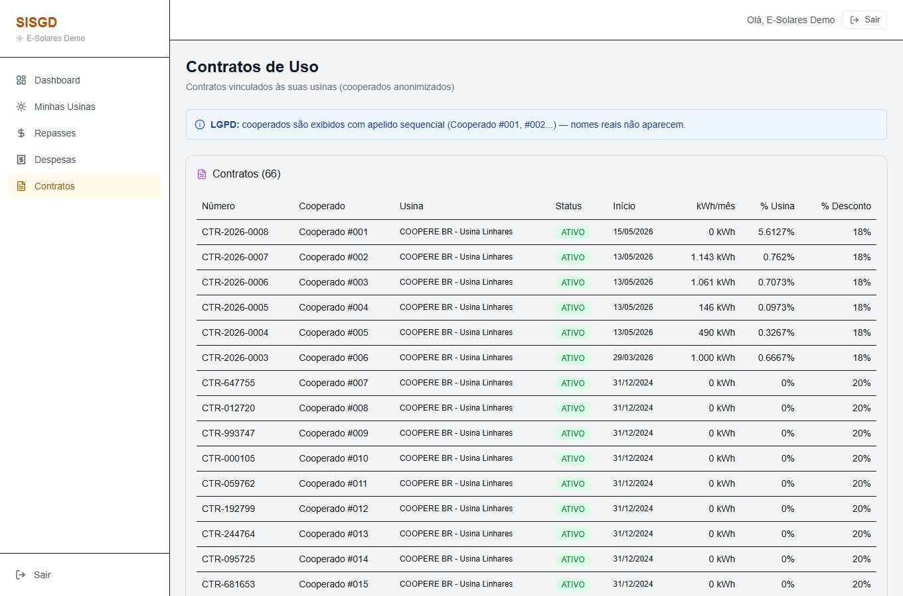

## 🚧 Em desenvolvimento (previsto, ainda não ativo)

1. **Lançamento da geração mensal (kWh) por tela** — hoje entra por API/import; usinas percentual/híbrido só calculam repasse com geração registrada (o exemplo usa fixo, não afetado).
2. **Rateio compartilhado** — existe como rótulo, sem cálculo de divisão automática.
3. **Status previsto × real** — em alguns pontos do painel do dono o status é estimado por data; o real vem do repasse registrado.
