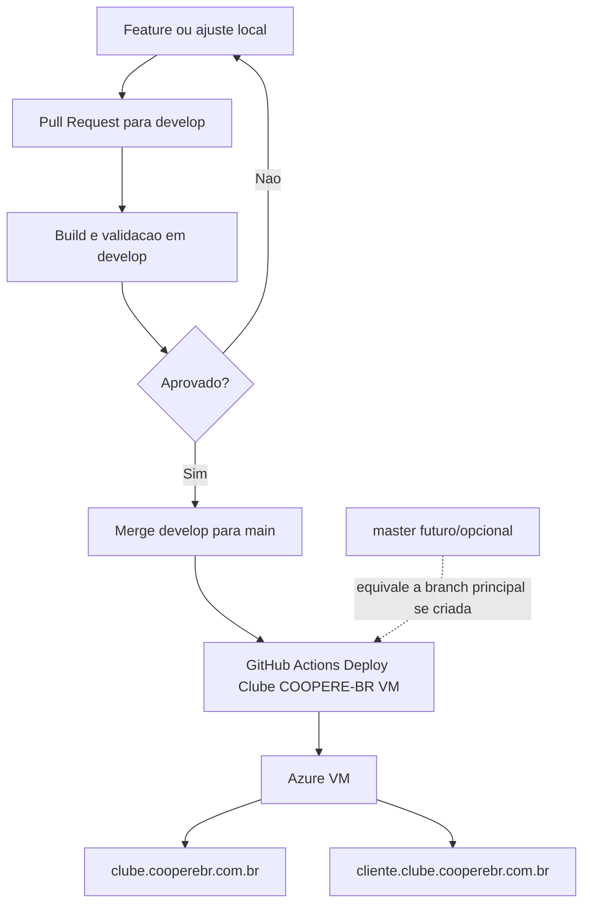

# Memoria do Projeto: Branches e Deploy do Clube COOPERE-BR

Este projeto usa uma separacao simples entre validacao e producao.

## Branches

- `develop`: branch de preparacao e teste. Use para juntar mudancas, revisar, rodar build e validar antes de promover.
- `main`: branch principal do repositorio. Neste projeto ela equivale ao que muitas equipes chamam de `master`.
- `master`: nao existe hoje no GitHub deste repositorio. Se for criada no futuro, o workflow ja aceita deploy a partir dela.

## Regra de publicacao

Para refletir em producao no Azure, a mudanca precisa chegar na branch principal:

- hoje: `main`
- futuro, se renomearem/criarem: `master`

Push em `develop` nao deve publicar producao automaticamente.

## Fluxo recomendado

1. Criar uma branch de trabalho a partir de `develop`.
2. Implementar e testar localmente.
3. Abrir PR para `develop`.
4. Validar build, testes e revisao em `develop`.
5. Fazer merge de `develop` para `main`.
6. O GitHub Actions publica o Clube COOPERE-BR no Azure.
7. Validar:
   - `https://clube.cooperebr.com.br`
   - `https://cliente.clube.cooperebr.com.br/login`
   - `https://cliente.clube.cooperebr.com.br/entrar`

## Workflow de deploy

Arquivo:

`.github/workflows/deploy-clube-cooperebr-vm.yml`

Esse workflow publica a aplicacao na VM do Azure usando SSH e o script:

`deploy/azure-vm/deploy.sh`

O deploy usa a branch que disparou o workflow:

`BRANCH=${{ github.ref_name }}`

## Diagrama

## Estado definido em 2026-07-18

- A branch `deploy/clube-cooperebr` foi usada para implantar o ambiente inicial do clube.
- As mudancas dessa branch foram promovidas para `main`.
- Foi criada a branch `develop` como copia da `main` apos a promocao.
- A publicacao de producao passou a apontar para a branch principal (`main`; ou `master` se existir no futuro).
